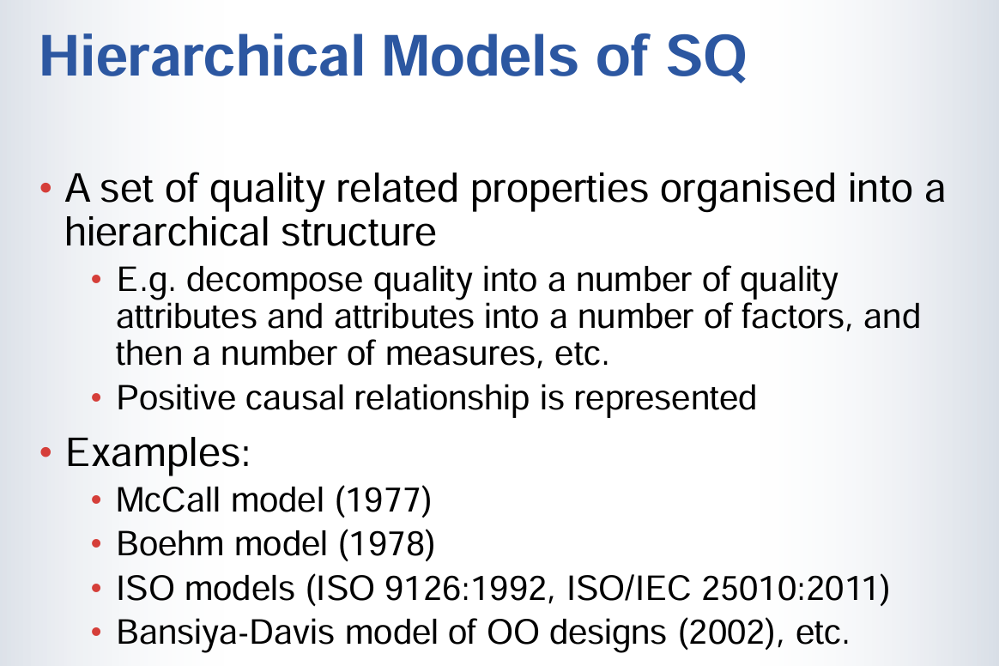
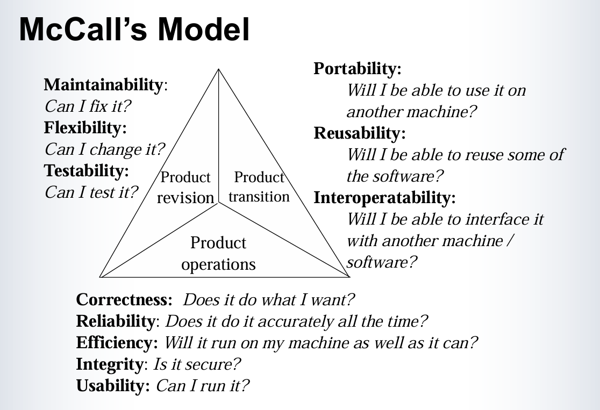
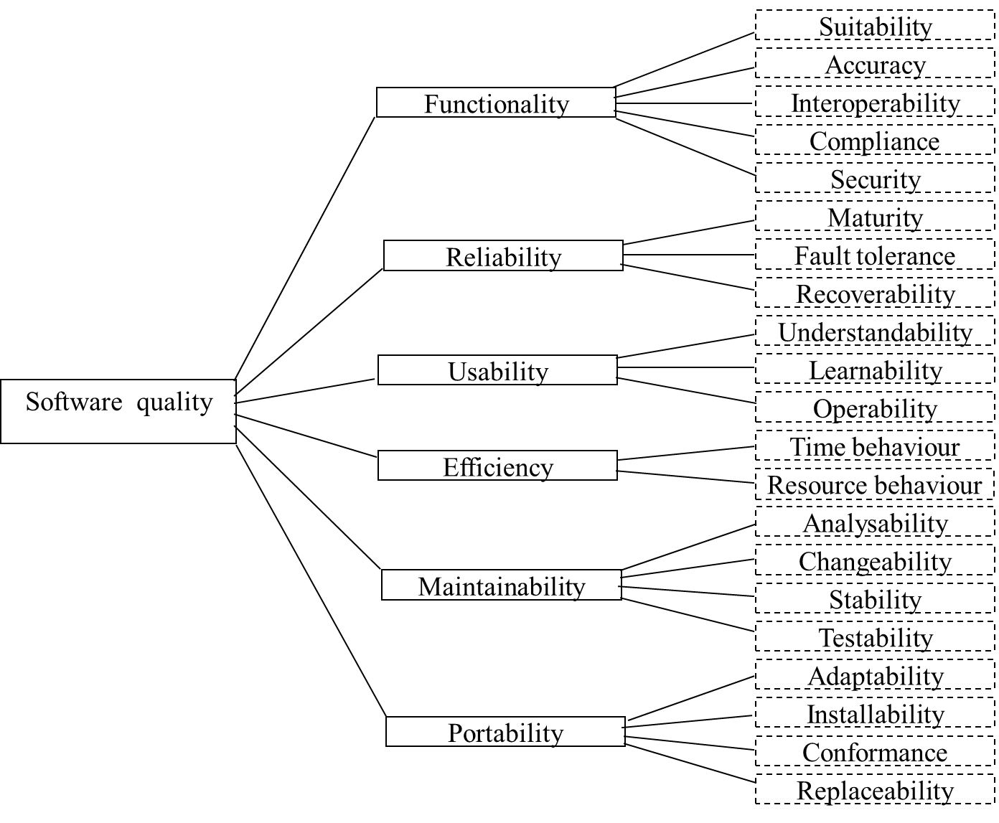
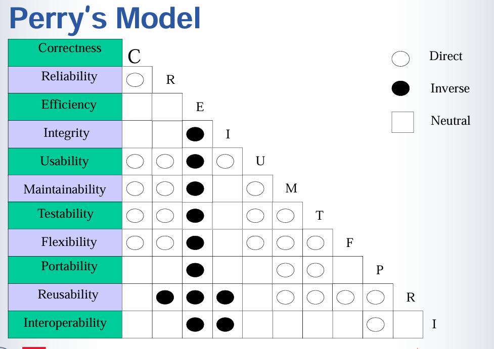
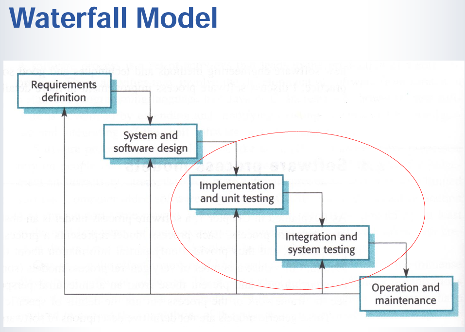
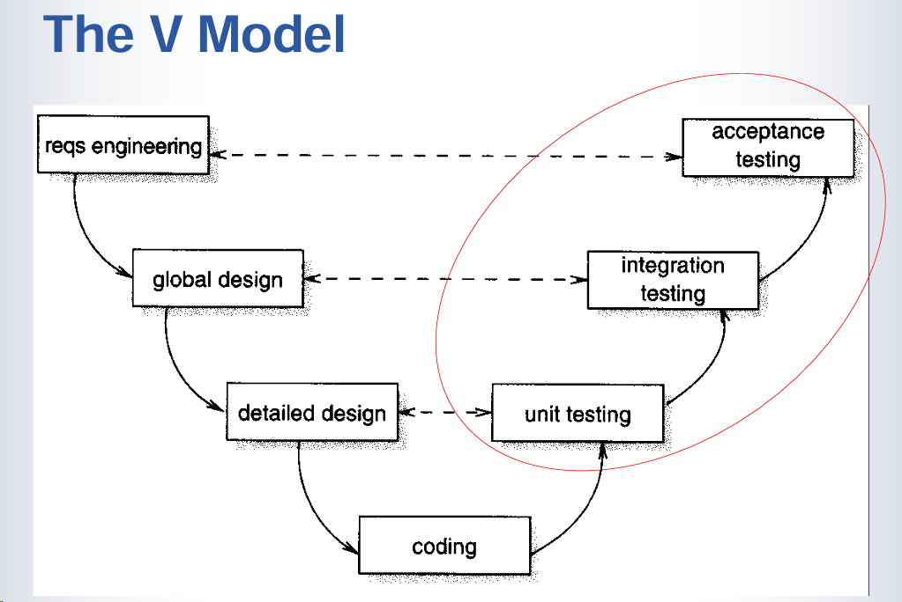
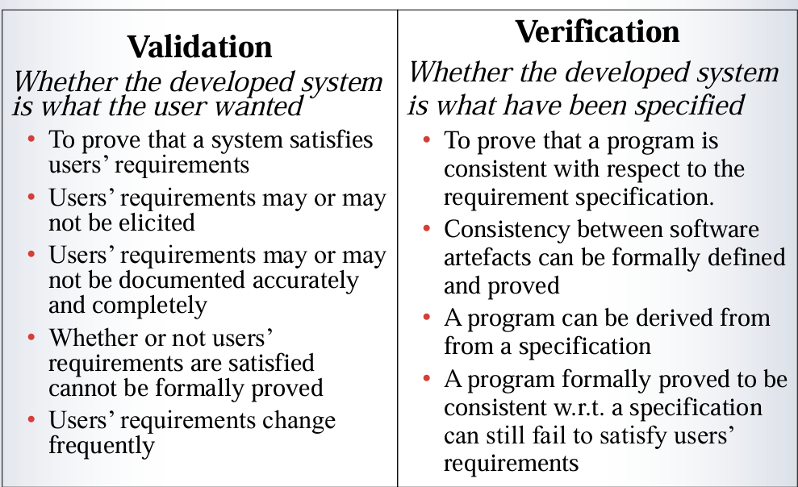
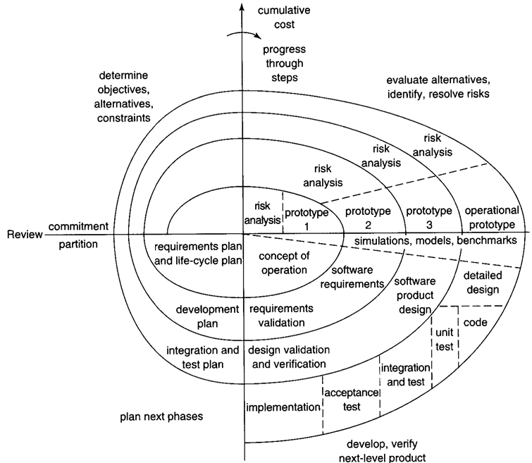
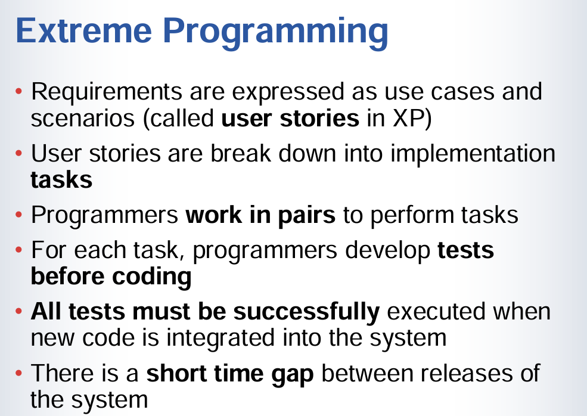

# What is software analysis and  testing?

 **Dynamic testing** 

- Verifying and validating software quality (e.g. correctness)  **through executing** software on a sample of input space 

动态测试(Dynamic Testing)：

- 这种方法通过实际运行软件并输入测试数据来验证和确认软件质量
- 关键词是"through executing"(通过执行)，即需要运行程序
- 主要用于验证软件的正确性等质量属性
- 测试时会选择一部分输入样本来执行

**Static analysis**

- Assessing and examining software quality through analysing software documents, code as well as other software artifacts **without executing** the program

静态分析(Static Analysis)：

- 这种方法不需要运行程序就可以评估软件质量
- 关键词是"without executing"(不需执行)
- 分析对象包括：
  - 软件文档
  - 源代码
  - 其他软件制品(artifacts)
- 通过审查和分析这些材料来评估软件质量

这两种方法的主要区别在于：

- 动态测试需要实际运行程序
- 静态分析不需要运行程序，只需查看和分析相关文档和代码

# Software Quality

## Garvin’s General Theory of Quality

 Garvin 的质量通用理论，它从5个不同的视角来定义和理解软件质量

* Transcendent view: Quality is universally recognisable. It isrelated to a comparison of features and characteristics ofproducts.

  超验视角 (Transcendent view)：

  - 认为质量是普遍可识别的
  - 通过比较产品的特征和特性来判断
  - 这是一个较为抽象和主观的视角

* Product-based view: Quality is a precise and measurablevariable. Differences in quality reflect the differences inquantities of some product attributes.

  基于产品的视角 (Product-based view)：

  - 将质量视为可精确测量的变量

  - 质量差异反映在产品属性的数量差异上

  - 强调可量化和客观测量

* User-based view: Quality is the fitness of intended uses.

  基于用户的视角 (User-based view)：

  - 质量取决于产品是否适合预期用途
  - 强调满足用户需求的程度
  - 以用户的角度来评判质量

* Manufacturing-based view: Quality is conformation to thespecifications.

  基于制造的视角 (Manufacturing-based view)：

  - 质量等同于符合规格说明的程度
  - 强调生产过程中的标准符合性
  - 关注产品是否达到预定的规格要求

* Value-based view: A quality product is one that providesperformance at an acceptable price or conformance at anacceptable cost.

  基于价值的视角 (Value-based view)：

  - 将质量与成本和价格关联起来
  - 强调在可接受的价格/成本下提供性能
  - 平衡质量与经济因素

# 软件质量模型（Software Quality Models）

### **Factors that affect software quality**：

- 直接影响质量的属性（Attributes directly indicate the quality of the system）：
- Attributes directly indicate the quality of he system,  e.g. reliability, correctness, user friendliness, etc.   
- Attributes indirectly related to quality, e.g. internal  complexity, etc. 
  - 这些属性能够直接反映系统的质量，例如**可靠性（Reliability）**、**正确性（Correctness）**和**用户友好性（User Friendliness）**等。
  - 例如，如果一个系统具有较高的可靠性和正确性，那么我们可以直接判断其质量较高。
- 间接影响质量的属性（Attributes indirectly related to quality）：
  - 一些属性不会直接反映在软件的外部表现上，但却会间接影响系统的质量，例如**内部复杂性（Internal Complexity）**。
  - 比如，过于复杂的内部架构可能会导致维护困难，从而间接影响软件的可维护性和长期可靠性。

### 2. **Interrelations between the factors**：

- 因果关系模型（Causality models）
  - Causal relationship, in terms of stereo-type relations
  - 因果关系模型描述了不同质量因素之间的**因果关系**，即一个因素如何影响另一个因素。这种关系可以通 过一些标准化的模式来理解，例如“可靠性如何依赖于代码复杂性”。

- 定量模型（Quantitative models）
  - Quantitative relations expressed as numerical functions,
  - Numerical values of the basic attributes are given, e.g.  through using metrics/measurements
  - The overall quality in an attribute on a more high level of  abstraction is calculated numerically
  - 定量模型通过**数值函数**来表示这些关系，将各个基础属性量化为数值，从而评估整体质量。
  - 这些属性的数值可以通过度量标准或测量来获得。比如，通过测量系统的错误率来量化其正确性，通过响应时间来量化性能等。
  - 定量模型可以帮助我们通过数值计算来总结出一个更高层次的质量评估结果。这些结果可以为决策者提供清晰的指导，帮助他们改进软件系统。

### 3. **定量模型的应用**：

- 定量模型强调了通过度量工具来评估软件质量属性的重要性。对于软件开发过程，定量模型能够帮助团队实时监控软件的质量变化。
- 例如，通过计算错误率、性能指标等，可以提供有力的证据来决定是否需要优化代码或改进某些功能。

# Hierarchical Models of Software Quality

### **定义**：

- **质量相关属性的层次结构（Hierarchical structure of quality properties）**：
  - 层次模型将软件质量分解为多个**质量属性**，每个质量属性又可以进一步分解为若干因素，这些因素可以通过**度量标准**来衡量。
  - 这种分解方法提供了一个清晰的框架，帮助我们理解软件质量的各个层次。例如，一个复杂的属性如“可维护性”可以分解为更小的、可测量的因素，如代码的可读性、模块化、文档质量等。
- **因果关系的表示（Positive causal relationship）**：
  - 层次模型不仅仅是属性的简单列表，它还展示了这些属性之间的**正向因果关系**。这意味着某些属性的改进可以直接或间接地影响其他属性。例如，代码的可读性提高可能会提升可维护性。

### 2. **例子**：

- McCall模型（1977年）：
  - McCall模型是早期的软件质量模型之一，提出了软件质量的三个主要方面：产品操作、产品修改和产品转换，每个方面又分为多个具体的质量属性（如正确性、效率、灵活性等）。
- Boehm模型（1978年）：
  - Boehm模型提出了一种更为复杂的层次化软件质量模型，将软件质量分解为多个层次，包含高层的质量特性以及底层的质量度量标准，强调质量属性之间的相互影响。
- ISO模型（ISO 9126:1992, ISO/IEC 25010:2011）：
  - ISO标准定义了软件质量的多个维度，包括功能性、可靠性、可维护性、效率、可移植性等。这些标准在实际的软件开发和评估过程中广泛应用，为不同类型的软件提供了质量评估依据。
- Bansiya-Davis模型（2002年）：
  - 该模型专注于面向对象设计的质量模型，提出了一种基于面向对象设计原则的质量评估框架，强调代码的可复用性、模块化和封装性等属性。

### 3. **层次模型的作用**：

- 帮助理解复杂系统的质量结构：
  - 通过将复杂的质量问题分解为更小的部分，层次模型使开发人员能够更系统地分析和改进软件质量。它帮助我们识别哪些质量属性最需要改进，并提供清晰的度量标准。
- 因果关系的洞察：
  - 层次模型中的因果关系展示了不同质量属性之间的相互作用，帮助开发人员理解如何通过改进一个属性来间接改善其他相关属性。这使得质量改进的过程更加有条理和有效。

## McCall’s Model

McCall的模型是一个经典的软件质量模型，它从三个主要维度来描述软件质量：

1. 产品修改 (Product Revision)：

- **可维护性 (Maintainability)**: "Can I fix it?" - 能否方便地修复软件缺陷
- **灵活性 (Flexibility)**: "Can I change it?" - 能否方便地修改或扩展功能
- **可测试性 (Testability)**: "Can I test it?" - 能否有效地进行测试

1. 产品转换 (Product Transition)：

- **可移植性 (Portability)**: "Will I be able to use it on another machine?" - 能否在不同平台上运行
- **可重用性 (Reusability)**: "Will I be able to reuse some of the software?" - 代码是否可以重复使用
- **互操作性 (Interoperability)**: "Will I be able to interface it with another machine/software?" - 能否与其他系统交互

1. 产品运行 (Product Operations)：

- **正确性 (Correctness)**: "Does it do what I want?" - 是否满足需求
- **可靠性 (Reliability)**: "Does it do it accurately all the time?" - 是否能始终正确执行
- **效率性 (Efficiency)**: "Will it run on my machine as well as it can?" - 运行性能如何
- **完整性 (Integrity)**: "Is it secure?" - 是否安全可靠
- **易用性 (Usability)**: "Can I run it?" - 是否容易使用

## ISO 9126 Model

ISO 9126模型是国际标准化组织(ISO)制定的软件质量模型，它将软件质量分为6个主要特性，每个特性下又包含若干子特性：

1. 功能性 (Functionality):
   - 适用性 (Suitability): 软件功能是否满足需求
   - 准确性 (Accuracy): 功能实现的准确程度
   - 互操作性 (Interoperability): 与其他系统交互能力
   - 依从性 (Compliance): 符合相关标准和规范
   - 安全性 (Security): 数据和系统的安全保护
2. 可靠性 (Reliability):
   - 成熟性 (Maturity): 软件的稳定程度
   - 容错性 (Fault tolerance): 发生故障时的处理能力
   - 可恢复性 (Recoverability): 系统恢复能力
3. 易用性 (Usability):
   - 可理解性 (Understandability): 用户理解软件的难易程度
   - 可学习性 (Learnability): 用户学习使用的难易程度
   - 可操作性 (Operability): 操作的便利性
4. 效率性 (Efficiency):
   - 时间特性 (Time behaviour): 响应时间和处理速度
   - 资源特性 (Resource behaviour): 资源利用效率
5. 可维护性 (Maintainability):
   - 可分析性 (Analysability): 缺陷分析的难易程度
   - 可改变性 (Changeability): 修改的难易程度
   - 稳定性 (Stability): 修改后的稳定性
   - 可测试性 (Testability): 测试的便利性
6. 可移植性 (Portability):
   - 适应性 (Adaptability): 适应不同环境的能力
   - 易安装性 (Installability): 安装的便利性
   - 一致性 (Conformance): 与移植相关标准的符合程度
   - 可替换性 (Replaceability): 用于替换其他软件的能力

# Relational Models of SQ

A quality model consists of:

* A number of quality attributes and factors, etc. 

* 多个质量属性和因素

  这些属性和因素之间的关系类型

*  A set of stereotypes of relationships between them,  normally include 

  * Positive relation: 

    High on one aspect of quality implies inevitably high on the  other

    当一个质量属性提高时，另一个质量属性也会随之提高。例如：代码的可读性提高可能会导致可维护性提高

  * Negative relation: 

    High on one aspect of quality implies inevitably low on the  other

    当一个质量属性提高时，另一个质量属性会降低。例如：系统的安全性增强可能会导致易用性降低

  * Neutral relation: 

    High or low on one aspect of quality does not imply on the  other aspect the quality is high or low.

    一个质量属性的变化不会影响另一个质量属性。两个质量属性之间没有必然的联系

*  Examples:

  * Perry model (1991)
  * Gillies model (1992, 1997)

## Perry model

**Perry模型（Perry Model）**是一个软件质量关系模型，主要通过研究不同软件质量属性之间的关系来帮助开发人员更好地理解这些属性的相互作用和影响。这张图表展示了不同质量属性之间的关系，具体分为以下几种类型：

### 1. **符号解释**

   - **实心圆（●）**：表示质量属性之间存在**强正相关**。一个属性的提高会带来另一个属性的提高。
   - **空心圆（○）**：表示质量属性之间存在**弱正相关**。即一个属性的提高可能会带动另一个属性的轻微提高，但不是必然的。
   - **空白**：表示这两个属性之间没有明显的相关性，提升一个属性不会直接影响另一个属性。

### 2. **质量属性分析**

   - **Correctness（正确性）**：软件的正确性表示软件能否按预期功能运行。它与多个其他属性存在相关性。例如，**可靠性（Reliability）**与正确性有较强的正相关，因为一个正确的软件通常也是可靠的。

   - **Reliability（可靠性）**：软件的可靠性表示在一定时间内持续无故障运行的能力。它与**完整性（Integrity）**和**可用性（Usability）**有较强的相关性，因为更可靠的软件通常具有更高的安全性和更好的用户体验。

   - **Efficiency（效率）**：效率主要是指软件在使用资源（如CPU、内存）时的优化程度。与**可移植性（Portability）**、**复用性（Reusability）**等属性没有明显的关联，但与**完整性（Integrity）**有正相关性。

   - **Integrity（完整性）**：表示软件在面对安全威胁时的防护能力。与可靠性和可维护性有较强的正相关性，因为更安全的软件往往也具有更好的稳定性和可维护性。

   - **Usability（可用性）**：指软件的易用性。与其他属性如**可维护性（Maintainability）**和**可移植性（Portability）**等有一定的相关性，因为一个易于使用的软件通常也易于维护和移植。

   - **Maintainability（可维护性）**：这是软件在开发和维护过程中进行修改的难易程度。与**测试性（Testability）**、**复用性（Reusability）**等有较强的正相关性，因为易于维护的软件通常也易于测试和复用。

   - **Testability（可测试性）**：表示软件是否易于进行测试。它与**可维护性**和**复用性**有强正相关，因为更易测试的软件通常也易于维护和复用。

   - **Flexibility（灵活性）**：指软件在面对变化时的适应能力。它与**可移植性**和**复用性**有一定的正相关性，意味着更灵活的软件更易于移植和复用。

   - **Portability（可移植性）**：这是软件在不同平台间迁移的能力。它与**复用性**和**互操作性（Interoperability）**有较强的正相关，因为一个易于移植的软件通常也易于复用和与其他系统交互。

   - **Reusability（复用性）**：指软件或其组件在其他项目中的再利用能力。与多个属性如**测试性**、**灵活性**和**可移植性**有较强的正相关性。

   - **Interoperability（互操作性）**：表示软件与其他系统或软件进行交互的能力。与**复用性**和**可移植性**有正相关性，因为一个易于集成的软件通常也更易于移植和复用。

## Notes on Software Quality

* **Inequality**: Quality attributes are not always of equal  importance. Some quality attributes are more important  than others. 

  **不平等性 (Inequality)**：

  - 软件质量的各个属性并非同等重要
  - 在具体项目中需要对不同质量属性进行优先级排序
  - 例如：对于银行系统，安全性可能比界面美观更重要

* **Context dependence**: An attribute may have different  importance in different software systems.

  **上下文依赖性 (Context dependence)**：

  - 质量属性的重要性取决于软件系统的具体应用场景
  - 不同类型的软件系统会强调不同的质量属性
  - 例如：游戏软件可能更注重性能，而医疗软件可能更注重可靠性

* **Variability**: The importance of a quality attribute for a  given software may change as time passes

  **可变性 (Variability)**：

  - 质量属性的重要性会随时间变化
  - 这种变化可能受多种因素影响（如用户需求变化、技术进步等）
  - 例如：早期可能更注重功能实现，后期可能更注重维护性

* **Subjectivity:** Different people may have different views on  quality even for the same software system.

  **主观性 (Subjectivity)**：

  - 不同的利益相关者对同一软件系统的质量评价可能不同
  - 这种差异可能来源于不同的视角和需求
  - 例如：开发者可能关注代码质量，而用户更关注易用性

* **Complexity:** Relationships between attributes are very  complicated; some are positive; some are negative.

  **复杂性 (Complexity)**：

  - 质量属性之间存在复杂的相互关系
  - 这些关系可能是正向的，也可能是负向的
  - 改进一个质量属性可能会对其他属性产生影响

# Why software analysis and testing is  necessary? 

1. **开发投入的重要性**：
- 在软件开发中，SAT占用超过50%的开发努力和成本
- SAT能够检测和帮助修复超过80%的软件缺陷(bugs)

2. **软件开发方法论中的核心地位**：
- SAT是所有软件开发方法论和过程模型中不可或缺的部分
- 它贯穿于整个软件开发生命周期

3. **质量保证的关键活动**：
- SAT是所有软件质量保证过程和基础设施的关键活动
- 确保软件产品满足质量要求和用户需求

4. **当前趋势**：
- 当前的趋势是采用自动化测试技术和工具
- 这样可以同时降低成本和提高质量

5. **降低风险**：
- 帮助提前发现和解决潜在问题
- 减少软件上线后的故障风险

6. **满足合规要求**：
- 许多行业有严格的质量标准和合规要求
- SAT帮助确保软件符合这些标准

# Software Processes

*  Software development and evolution is typically a  complicated process that 

  * Conducted by many **stakeholders**

    软件开发涉及多个参与方

    可能包括：

    - 开发团队
    - 项目经理
    - 客户/用户
    - 测试人员
    - 其他相关方

  * Consists of a set of interrelated **activities**

    * 构建活动 Constructive activities: e.g. design, coding 
    * 质量保证活动Quality assurance activities: e.g. testing, measurement
    * 管理活动Management activities: e.g. set project budget

  * Produces and uses a variety of **artifacts**

    * Input: e.g. document of user’s requirements 
    * Deliverables: e.g. executable code
    * Internal: e.g. bug report 

## Software Process Models

- 是软件过程的简化表示，通常从特定视角展现
- 是一组软件过程的抽象表示，强调高层管理决策

### Waterfall Model

瀑布模型(Waterfall Model)，它描述了软件开发的线性顺序流程。

**开发阶段**：

1. **需求定义** (Requirements definition)：

- 确定系统功能和约束
- 与用户沟通，收集需求

1. **系统和软件设计** (System and software design)：

- 建立系统整体架构
- 详细的软件设计规划

1. **实现和单元测试** (Implementation and unit testing)：

- 软件编码实现
- 对各个单元进行测试

1. **集成和系统测试** (Integration and system testing)：

- 将各个单元集成
- 对整个系统进行测试

1. **运行和维护** (Operation and maintenance)：

- 系统部署和运行
- 维护和问题修复

**优点**：

1. 流程清晰，管理简单
2. 有利于大型项目的人员组织和管理
3. 每个阶段都有明确的可交付成果
4. 适合需求明确且变化较少的项目

**缺点**：

1. 开发过程缺乏灵活性，难以适应需求变化
2. 后期发现的问题修复成本高
3. 用户要等到项目后期才能看到系统
4. 风险和问题容易在后期才暴露
5. 各阶段的反馈周期较长

**适用场景**：

- 需求明确且稳定的项目
- 技术成熟的领域
- 开发团队对应用领域很熟悉
- 项目时间充足，对变更要求不高的情况

### The V Model

V模型是瀑布模型的一个变体，它强调了测试活动与开发活动的对应关系。

**模型结构**：

1. **左侧下降部分（开发活动）**：

- 需求工程 (Requirements Engineering)
- 全局设计 (Global Design)
- 详细设计 (Detailed Design)
- 编码 (Coding)

1. **右侧上升部分（测试活动）**：

- 单元测试 (Unit Testing)
- 集成测试 (Integration Testing)
- 验收测试 (Acceptance Testing)

1. **横向关联（虚线）**：

- 表示每个开发阶段与对应测试阶段的关系
- 强调测试计划应该在相应的开发阶段就开始准备

**优点**：

1. 明确展示了测试活动的重要性
2. 强调测试计划要早期制定
3. 清晰定义了各个测试阶段的目标和范围
4. 有助于提高测试的系统性和完整性
5. 方便跟踪项目进度

**缺点**：

1. 仍然基于瀑布模型，继承了其主要缺点
2. 测试活动滞后于开发活动
3. 早期的需求分析和设计错误要到后期才能被发现
4. 难以应对需求变更
5. 周期较长，成本较高

**适用场景**：

- 需求稳定的项目
- 对测试要求严格的项目
- 安全关键性系统
- 对质量要求高的项目
- 项目团队经验丰富

## (重点)Validation vs Verification

**验证(Validation)**：
- **核心问题**："我们是否开发了正确的系统？"(Are we building the right product?)
- **关注点**：
  - 确保系统满足用户实际需求
  - 评估系统的实用性和实际价值
- **特点**：
  - 用户需求可能未被完全获取
  - 需求文档可能不准确或不完整
  - 难以进行形式化证明
  - 需求经常发生变化
  

**确认(Verification)**：
- **核心问题**："我们是否正确地开发了系统？"(Are we building the product right?)
- **关注点**：
  - 确保系统符合规格说明
  - 检查系统是否按照规范实现
- **特点**：
  - 可以形式化定义和证明
  - 可以从规格说明推导出程序
  - 软件制品之间的一致性可以验证
  - 即使通过验证的程序也可能不满足用户需求

**主要区别**：
1. **目标**：
   - Validation关注用户满意度
   - Verification关注技术规范

2. **方法**：
   - Validation多依赖用户反馈
   - Verification可以使用形式化方法

3. **可证明性**：
   - Validation难以形式化证明
   - Verification可以进行形式化证明

4. **时间特性**：
   - Validation需要持续进行
   - Verification在特定阶段进行

这两个过程是相辅相成的，共同确保软件质量。一个成功的软件项目需要同时重视这两个方面。

### Boehm’s Spiral Model

Boehm的螺旋模型是一个以风险为驱动的软件开发模型

**主要特征**：

1. **螺旋结构**：

- 每个螺旋周期分为四个象限
- 随着项目进展，螺旋线由内向外扩展
- 累积成本和完成度随螺旋展开而增加

1. **四个主要阶段**（象限）：

- **确定目标**：设定目标、识别约束条件
- **风险评估**：分析风险、评估方案
- **开发与验证**：实现产品、验证结果
- **规划**：评审成果、规划下一阶段

1. **关键要素**：

- 原型开发（多次迭代）
- 持续的风险分析
- 用户参与和反馈
- 详细的规划和控制

**优点**：

1. 强调风险管理
2. 支持早期原型和用户反馈
3. 适应性强，可以根据需求变化调整
4. 渐进式开发，降低项目风险
5. 适合大型复杂项目

**缺点**：

1. 模型复杂，管理难度大
2. 需要高度的风险评估能力
3. 开发成本相对较高
4. 周期可能较长
5. 不适合小型项目

**适用场景**：

- 大型复杂项目
- 高风险项目
- 创新性项目
- 用户需求不明确的项目
- 预算充足的项目

### Principles of Agile Methods

**以客户为中心**：

- 最高优先级是通过持续交付满足客户需求（原则1）
- 欢迎需求变更，即使在开发后期（原则2）
- 频繁交付可工作的软件（原则3）

**团队协作**：

- 业务人员和开发人员需要每日合作（原则4）
- 面对面交流是最有效的信息传递方式（原则6）
- 依靠自组织团队（原则11）

**持续改进**：

- 工作软件是进度的首要度量标准（原则7）
- 团队定期反思并调整工作方式（原则12）
- 保持可持续的开发节奏（原则8）

**技术实践**：

- 持续关注技术卓越和良好设计（原则9）
- 简单性是核心（原则10）

**人员管理**：

- 围绕积极主动的个人建设项目（原则5）
- 给予团队信任和支持

这些原则共同构成了敏捷开发的基础，强调：

- 适应变化而非遵循计划
- 人员互动胜过流程工具
- 客户协作重于合同谈判
- 工作软件胜过详尽文档

### Extreme Programming

极限编程(Extreme Programming, XP)是一种敏捷开发方法

**核心实践**：

1. **需求管理**：

- 使用用户故事(User Stories)表达需求
- 用户故事比传统需求更简洁、更聚焦于用户价值
- 将故事分解为具体的实施任务

1. **结对编程(Pair Programming)**：

- 两个程序员一起工作
- 一人编码，一人审查
- 提高代码质量，促进知识共享

1. **测试驱动开发(TDD)**：

- 先写测试，后写代码
- 所有代码都必须有对应的测试
- 测试必须全部通过才能集成代码

1. **持续集成/交付**：

- 频繁的系统发布
- 较短的发布周期
- 快速获取用户反馈

**XP的优势**：

- 代码质量高
- 缺陷发现早
- 团队协作好
- 知识共享充分
- 适应变化能力强

**XP的挑战**：

- 需要高素质的团队
- 结对编程可能增加人力成本
- 要求开发人员具备较强的测试能力
- 需要客户深度参与

XP特别强调技术实践，通过严格的工程实践来确保软件质量，是敏捷方法中较为严格和规范的一种方法。

# Lehman’s Theory of SW  Evolution 

Lehman的软件演化理论是软件工程中的一个重要理论，它从三个主要方面探讨了软件系统的演化：

1. **软件系统分类 (Classification of software systems)**：
研究问题：软件系统如何根据其演化行为进行分类？
2. **软件开发中的不确定性 (Uncertainties in software development)**：
研究问题：为什么软件系统会表现出演化行为？软件演化的驱动力是什么？

3. **软件演化定律 (Laws of software evolution)**：
研究问题：软件演化有哪些共同的特征属性和规律？

## Lehman’s Classification of Software

Lehman将软件系统分为三种类型，主要基于它们的正确性定义和演化特征：

1. **S型(Specification-based)**：
- 基于预先定义的规范
- 特点：
  - 规范清晰且详细
  - 正确性取决于程序是否完全符合规范
  - 评判标准明确和客观
- 示例：编译器(如GCC)，需要严格遵循语言标准

2. **P型(Problem-based)**：
- 解决现实世界中的具体问题
- 特点：
  - 正确性基于解决方案的可接受度
  - 涉及用户主观判断
  - 不同用户可能有不同的接受标准
- 示例：在线支付系统(如PayPal)，需要提供便捷且灵活的支付解决方案

3. **E型(Embedded in real-world)**：
- 在真实环境中运行的应用
- 特点：
  - 通常没有明确的规范说明
  - 正确性由用户判断
  - 需要持续适应变化的需求
  - 基于实际使用效果和用户满意度评判
- 示例：社交媒体应用(如Facebook)，需要持续根据用户反馈更新改进

## Uncertainties in Software Development

1. **哥德尔式不确定性 (Gödel-like uncertainty)**：
- **本质**：源于软件系统作为模型的固有特性
- **主要特点**：
  - 软件系统是现实世界的抽象模型
  - 模型与现实世界的关系本质上是不完备的
  - 程序的所有属性无法被完全认知
- **影响**：导致系统无法完全反映现实世界的复杂性

2. **海森堡式不确定性 (Heisenberg-type uncertainty)**：
- **本质**：使用系统会改变用户的认知和理解
- **表现形式**：
  - 用户对需求的不确定性("看到了才知道想要什么")
  - 需求的持续变化
- **影响**：导致需求持续演化和变更

3. **实用性不确定性 (Pragmatic uncertainty)**：
- **本质**：来自人为因素和技术应用
- **来源**：
  - 采用新的开发方法时的适应问题
  - 使用新工具或编程语言带来的风险
  - 团队学习曲线
- **影响**：影响项目执行效率和质量

