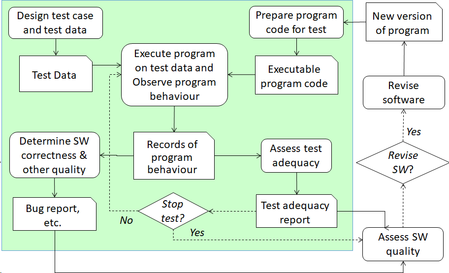
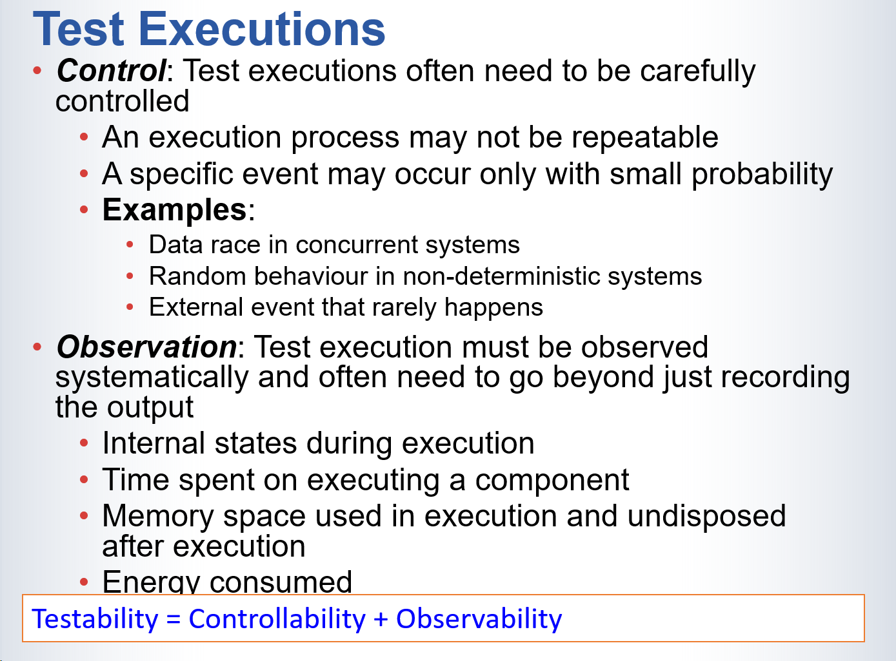
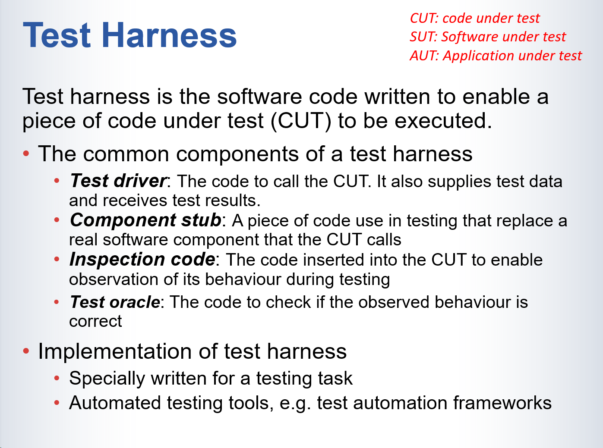

# Process of Software Testing



1. **准备测试程序代码**（Prepare program code for test）
   - 在进行测试之前，首先需要准备好可执行的程序代码，以便进行测试。
2. **设计测试用例和测试数据**（Design test case and test data）
   - 根据软件需求，设计具体的测试用例和数据，以涵盖不同的测试场景。
3. **执行程序并观察行为**（Execute program on test data and observe program behaviour）
   - 使用测试数据运行程序，并观察程序的实际行为是否符合预期结果。
4. **记录程序行为**（Records of program behaviour）
   - 测试过程中，记录程序的行为，包括输出和状态变化，以供后续分析。
5. **评估软件的正确性和其他质量属性**（Determine SW correctness & other quality）
   - 分析记录的行为，确定软件的正确性，发现潜在的错误或不符合的地方。
6. **生成Bug报告**（Bug report, etc.）
   - 如果发现问题，生成Bug报告，详细描述问题，以便开发人员修复。
7. **评估测试充分性**（Assess test adequacy）
   - 判断测试是否已经充分覆盖了软件的所有功能和代码路径，确保测试的全面性。
8. **生成测试充分性报告**（Test adequacy report）
   - 根据测试的结果，生成测试充分性报告，概述测试覆盖率和测试结果。
9. **决定是否停止测试**（Stop test?）
   - 如果测试结果表明软件质量符合要求，则可以停止测试；否则继续测试。
10. **评估软件质量**（Assess SW quality）

- 综合考虑测试结果和Bug报告，评估软件整体的质量。

1. **决定是否需要修订软件**（Revise SW?）
   - 如果评估结果显示软件仍有问题，则需要修订软件。
2. **修订软件**（Revise software）
   - 根据评估结果，修复软件中的问题，生成新版本的程序代码。
3. **新版本的程序**（New version of program）
   - 修订后的软件生成新的版本，进入下一个测试循环或交付阶段。

# （重点）Test Cases and Test Data

**Test Case** 

- •An abstract situation in which a test is to be executed

- •Examples:

  - student uses Oxford Brookes University’s web site to search for a course for study

  - A motorist uses Google Map to find the route from home to a tourist attraction

测试用例(Test Case):

- 是一个抽象的测试场景或情况
- 描述了测试需要执行的一般性情况
- 使用通用/抽象的术语来描述测试场景
- 示例:
  - "一个学生使用牛津布鲁克斯大学网站搜索课程进行学习"
  - "一个驾驶员使用谷歌地图寻找从家到旅游景点的路线"

**Test Data**

- A set of specific data to input into a SUT together with the expected output or behaviour from the software in order to test the SW

- Examples:

  - John uses Oxford Brookes University’s website to search for the undergraduate course on computer science of 2015 entry

  - John uses Google Map to find the route from 10 Downing Street to London Bridge. 

测试数据(Test Data):

- 是具体的输入数据和预期输出结果的集合

- 用于实际执行测试的具体数值或信息

- 包含特定的、可执行的数据

- 示例:

  - "John使用牛津布鲁克斯大学网站搜索2015年入学的计算机科学本科课程"
  - "John使用谷歌地图寻找从唐宁街10号到伦敦桥的路线"

  

- 测试数据是测试用例的具体实例化
- 通过提供具体的数据值，测试数据让抽象的测试用例变得可执行
- 一个测试用例可以有多个不同的测试数据集
- 测试数据需要包含具体的输入值和预期的输出结果

## Design Test Cases/Data

- Test case/data generation
  - To derive test cases/data from software requirements specification, program code, quality requirements, and intended usage of the system, etc. 

- Test case/data selection
  - To select a subset of test cases/data from an existing set of test cases, which could be previously generated, recorded from previous executions of the system or similar systems, etc. 

- Test case/data prioritization 

  - To give priorities to the test cases/data in a test suite 

    - Classifying test cases/data into a number of different priorities

    - Listing test cases/data sequentially from highest priority to the lowest

1. 测试用例/数据生成 (Test case/data generation)
- 目的是从多个来源导出测试用例和数据，包括：
  - 软件需求规格说明
  - 程序代码
  - 质量要求
  - 系统的预期使用场景
- 这是创建新测试用例的过程

2. 测试用例/数据选择 (Test case/data selection)
- 从已有的测试用例集合中选择合适的子集
- 这些测试用例可能来自：
  - 之前生成的测试用例
  - 系统之前运行的记录
  - 类似系统的测试记录
- 目的是有效利用现有的测试资源

3. 测试用例/数据优先级划分 (Test case/data prioritization)
- 为测试套件中的测试用例设定优先级
- 包含两个主要活动：
  - 将测试用例分类为不同的优先级别
  - 按照优先级从高到低排序列出测试用例

## Forms of Test Cases/Data

- Input/Output Pair
  - Each test case/data is a pair of input and expected output

输入/输出对 (Input/Output Pair)

- 最基本的测试形式
- 由输入数据和预期输出结果组成的配对
- 适用于简单的功能测试
- 例如：测试一个计算器程序，输入"2+2"，预期输出"4"

- Interaction Sequence
  - Each test case/data is a sequences of input/output pairs that describes the interaction between the system and its caller

​				交互序列 (Interaction Sequence)

- 由一系列输入/输出对组成
- 描述系统与调用者之间的连续交互过程
- 适用于需要多步骤操作的功能测试
- 例如：测试用户登录流程，包含：
  - 输入用户名 → 验证用户名
  - 输入密码 → 验证密码
  - 提交登录 → 显示登录结果

- Interaction Tree (Adaptive test cases)
  - Each test case/data is a tree where branches indicate different possible ways the test can progress forward depending on the outcomes of the previous step(s) in the testing

​				交互树（自适应测试用例）(Interaction Tree/Adaptive test cases)

- 以树状结构表示测试流程
- 根据前一步骤的结果决定下一步的测试路径
- 分支表示不同的可能测试路径
- 特别适用于测试非确定性软件
- 例如：测试一个在线支付系统：
  - 支付成功 → 显示收据
  - 支付失败 → 显示错误信息 → 重试或取消

# Test Requirements and Criteria

Test requirements

- The statements that answer the questions 

  - *On what test cases a software should be tested*?
  - *To what extent the software is to be tested on each test case*?

  定义：用于回答两个关键问题的具体陈述：

  1. 软件应该在哪些测试用例上进行测试？
  2. 每个测试用例应该测试到什么程度？

- Example: 

  - The nuclear power plant protection system must be tested on all known situations that the coolant water loses pressure; and for each known situation, it must be tested on 50,000 randomized test data.

  示例说明：

  - 核电站保护系统的测试需求：
  - 必须测试所有已知的冷却水失压情况
  - 每种情况必须进行50,000次随机测试数据的测试
  - 这个例子展示了测试的全面性和深度要求

Test criteria

- The general principles employed to set test requirements for a specific AUT. 
- 定义：用于为特定被测应用设置测试需求的一般性原则

- Example: 

  - For each use case, the software must be tested on at least one test case that executes the main flow of the use case. 
  - Every statement in the source code must be executed at least once in testing

  

  示例包括：

  1. 用例覆盖准则：每个用例的主流程必须至少有一个测试用例
  2. 代码覆盖准则：源代码中的每个语句必须至少执行一次

1. CUT: Code Under Test (被测代码)
2. SUT: Software Under Test (被测软件)
3. AUT: Application Under Test (被测应用)

# Test Executions



**测试执行（Test Executions）**中的两个关键要素：控制（Control）和观测（Observation），阐明了如何提高系统的可测试性。

### 1. **控制（Control）**

- **解释**：测试执行过程需要被仔细控制，因为有些测试过程可能**不可重复**，某些特定事件可能只会以非常小的概率发生。
- 示例：
  - **数据竞争（Data race）**：在并发系统中，不同线程或进程可能会同时访问共享数据，导致竞争条件。
  - **非确定性系统的随机行为**：有些系统在相同输入下可能表现出不同的行为，例如随机数生成器。
  - **罕见的外部事件**：例如一些外部事件（如网络故障或硬件故障）可能很少发生，但仍需考虑。

### 2. **观测（Observation）**

- **解释**：测试执行不仅仅是记录输出，还需要系统化地观察执行过程中的多个内部因素。
- 观测的内容：
  - **执行中的内部状态**：例如变量的值、系统状态等。
  - **执行某个组件所花费的时间**：分析系统的性能瓶颈。
  - **使用的内存空间**：特别是执行结束后未释放的内存。
  - **消耗的能量**：在移动设备或嵌入式系统中，能量消耗是关键指标。

### 3. **可测试性公式**

- **公式**：**Testability = Controllability + Observability**
- **解释**：系统的可测试性依赖于其**可控性（Controllability）和可观测性（Observability）**。也就是说，测试人员是否能够控制系统的状态，并且是否能够观察到足够的系统内部信息来判断其行为。

### 总结：

- **控制**：确保特定条件和事件可以被触发，并且测试过程可重复。
- **观测**：不仅关注测试输出，还要关注系统执行过程中的细节，如内部状态、性能和资源使用。
- **提高可测试性**：要提高系统的可测试性，需要在测试过程中有良好的控制和全面的观测能力，以便准确评估软件质量。

# Test Harness



### 1. **测试工具（Test Harness）**

- **定义**：测试工具是专门编写的软件代码，目的是使**被测代码（CUT：Code Under Test）**能够被执行。它帮助测试人员在没有完整系统的情况下对软件进行测试。

### 2. **测试工具的常见组成部分**

- **测试驱动程序（Test driver）**：
  - 作用：调用被测代码（CUT），并提供测试数据，接收测试结果。它相当于控制被测代码执行的主程序。
- **组件桩（Component stub）**：
  - 作用：用来替换被测代码调用的实际软件组件。当某个真实组件暂时不可用时，组件桩可以用来代替它，从而使被测代码能够正常编译和执行。
- **检查代码（Inspection code）**：
  - 作用：插入到被测代码中，以便在测试过程中观察其行为。检查代码记录被测代码的内部状态和执行路径，帮助判断软件是否按照预期运行。
- **测试Oracle（Test oracle）**：
  - 作用：验证观察到的行为是否正确。测试Oracle是一段代码，它通过比对期望结果和实际结果来判断测试是否成功。

### 3. **测试工具的实现**

- **专门为测试任务编写**：根据具体测试需求，编写定制的测试工具代码。
- **自动化测试工具**：例如，使用测试自动化框架（如JUnit、Selenium等）来实现自动化测试。

# Test Adequacy Criteria

 A test adequacy criterion is a rule that determines whether a test is done adequately so that a general conclusion on the quality of the software can be drawn confidently based on the observations made during testing. 

测试充分性准则是一个规则，用于确定测试是否已经充分完成，从而能够基于测试过程中的观察结果对软件质量做出可靠的结论。

作为停止规则**As a stop rule:**

- Used during testing process to determine when enough testing has been done and thus the testing can stop.

- 在测试过程中用来判断是否已经进行了足够的测试
- 帮助决定何时可以停止测试
- 避免过度测试和资源浪费

作为设计规则**As a design rule:**

- Used during test design to determine the test cases/data

- 在测试设计阶段使用

  帮助确定需要哪些测试用例和测试数据

  指导测试用例的设计过程

作为度量标准**As a metric:**

- To measure to what extent the test has been done adequately

- 用来衡量测试的充分程度

  评估测试的完整性和覆盖率

  提供测试进度和质量的量化指标

## Some Well-Known Adequacy Criteria

1. 语句覆盖（Statement coverage）

语句覆盖(Statement coverage)实际上既关注代码本身，也可以应用于Control Flow Graph(CFG)。

- 要求：被测代码（CUT）中的每个语句至少执行一次
- 目的：确保所有代码都被执行到
- 这是最基本的覆盖标准

2. 分支覆盖（Branch coverage）
- 要求：代码中的每个控制转移分支（如if-else语句）都必须至少执行一次
- 比语句覆盖更严格
- 确保所有可能的执行路径都被测试到

3. 变异测试（Mutation testing）
- 过程：在代码中故意插入一个错误（变异体）
- 要求：测试必须能够检测出这个插入的错误（"杀死"变异体）
- 目的：验证测试用例能否检测出程序中的错误
- 这是一种更高级的测试技术

4. 超链接路径覆盖（Hyperlink path coverage）
- 适用于：网站等超文本系统
- 要求：系统中的每个超链接路径都必须被遍历
- 确保：
  - 所有导航路径都是可达的
  - 没有断链
  - 用户可以访问所有页面

# Functional Testing

1. 功能测试 (Functional Testing)
- 主要目标：验证和确认软件系统或组件功能的正确性
- 分为两个层次：
  1. 系统级功能测试
     - 针对系统的功能需求进行测试
     - 验证整个系统的功能是否符合要求
  2. 组件/单元级功能测试
     - 针对单个组件或单元的功能规格说明进行测试
     - 验证组件设计中规定的功能是否正确实现

2. 基于风险的功能测试 (Risk Based Functional Testing)
- 基本理念：
  - 系统中不同功能的重要性不同
  - 测试资源应根据功能的重要性进行分配

- 执行过程：
  1. 列出所有需要测试的功能
  2. 分析每个功能相关的风险：
     - 可能出现的错误
     - 使用场景的频率
     - 错误发生的后果
  3. 为功能分配优先级：
     - 后果越严重/损失越大，优先级越高
     - 使用频率越高，优先级越高

# Derive Test Cases from Activity Diagrams

* A test case corresponding to a control flow path starting from the begin node to and end node;

* Generate a test case following the steps below:

  * Find a control path starting from the begin node to and end node;

  * List the activities on the path to generate a sequence of actions to be performed by the user and the expected actions to be performed by the system; 

  * Note the object entities generated by each action and used by each action as the input or the output of the system. 

- 每个测试用例对应一条从开始节点到结束节点的控制流路径
- 这种方法确保测试覆盖了系统的完整工作流程

生成测试用例的三个步骤：

1. 寻找控制路径
- 从开始节点找到一条到结束节点的完整路径
- 确保路径是有效和可执行的
- 记录路径上的所有节点和转换

2. 列出活动序列
- 记录用户需要执行的操作
  - 例如：输入数据、点击按钮等
- 记录系统预期的响应
  - 例如：显示结果、更新数据等
- 确保操作的顺序正确

3. 记录对象实体
- 识别每个动作产生的对象
- 识别每个动作使用的输入对象
- 明确系统的输入和输出
  - 输入可能是用户数据、文件等
  - 输出可能是计算结果、报告等

# Functional Testing in Agile Methodology

Behaviour-Driven Development (BDD)
行为驱动开发(BDD)的特点：

1. 发展背景
- 是测试驱动开发(TDD)的进一步演进
- 主要关注如何从用户故事中获取测试用例
- 提供了一个系统化的开发规范

2. 核心流程：
- 编写用户故事和场景
  - 使用结构化的自然语言
  - 便于非技术人员理解
  - 确保需求清晰明确

- 场景转换
  - 将用户场景系统地转换为程序代码
  - 生成相应的测试脚本
  - 保持代码和需求的一致性

3. 自动化支持：
- 使用自动化工具（如JBehave）
- 与XUnit测试框架集成
- 主要功能：
  - 解析和检查场景描述的语法
  - 将场景描述自动转换为测试代码

# JBehave Syntax of User Stories

JBehave中User Stories的写法包含四个主要部分：

1. Title（标题）

- 故事的标题/名称

2. Narrative（叙述）

- In order to：说明故事的目的/原因
- As a：说明用户类型
- I want to：描述想要实现的功能

例如

```
Title: Online Shopping Checkout
Narrative:
In order to: purchase items conveniently
As a: registered customer
I want to: complete my purchase online
```

3. Lifecycle（生命周期）

- Before：每个场景执行前的步骤
- After：场景执行后的步骤，包括三种情况：
  - ANY：无论成功失败都执行的步骤
  - SUCCESS：成功时执行的步骤
  - FAILURE：失败时执行的步骤

4. Scenarios（场景列表）

- 列出所有测试场景
- 每个场景通常包含：
  - Given（前提条件）
  - When（触发事件）
  - Then（预期结果）

完整示例：

```
Title: Online Shopping Checkout

Narrative:
In order to: purchase items conveniently
As a: registered customer
I want to: complete my purchase online

Lifecycle:
Before:
  Given the user is logged in
After:
  SUCCESS: Send confirmation email
  FAILURE: Log error details

Scenarios:
Scenario: Successful purchase
Given shopping cart contains items
When user confirms payment
Then order should be processed
```

JBehave中场景(Scenario)的语法由三个主要部分组成，每个部分都有特定的关键字和用途：

1. 前置条件 (Pre-condition)
- 关键字：`Given`
- 用途：
  - 描述功能调用前的假设条件
  - 设置测试的初始状态
  - 为后续步骤建立前提条件

2. 触发事件/守卫条件 (Trigger event/Guard condition)
- 关键字：`When`
- 用途：
  - 描述触发功能执行的事件
  - 指定功能执行的守卫条件
  - 表示用户或系统的具体动作

3. 后置条件 (Post-condition)
- 关键字：`Then`
- 用途：
  - 描述预期的结果
  - 指定操作后系统应该处于的状态
  - 定义验证条件

示例：
```
Scenario: User login
Given a user with valid credentials
When the user submits login form
Then the user should be logged in
```
