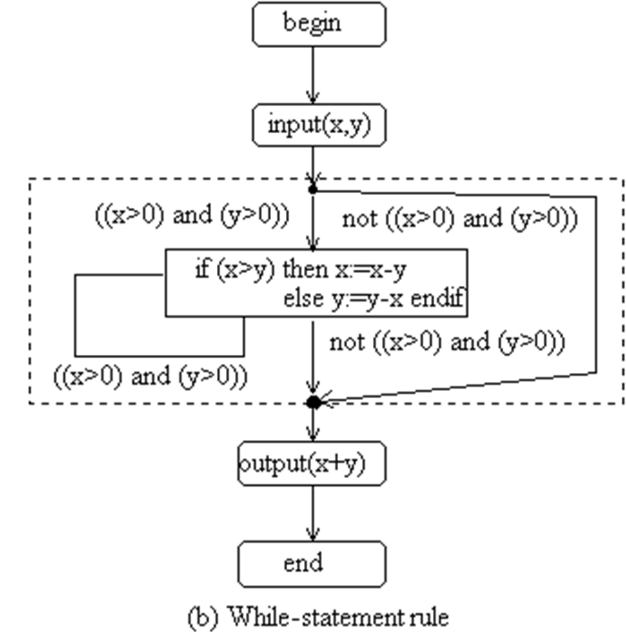

# Basic Ideas of Structural Testing

Use of structural information about the software under test to perform key activities of software testing

- Deriving test cases and test data
- Measuring test adequacy

Principle:

- An adequate test must thoroughly cover the structure of the software under test, because if an element in the system is not tested, there is no evidence to say that the element is correct. 

结构测试的核心内容包括：

1. 基本定义：
结构测试是利用软件内部结构信息来执行软件测试的关键活动。这意味着测试人员需要了解代码的内部实现，比如代码的逻辑流程、分支、循环等结构信息。

2. 主要活动：
- 导出测试用例和测试数据：基于代码结构设计合适的测试用例，并准备相应的测试数据
- 衡量测试充分性：评估测试覆盖的程度，确保测试的完整性

3. 核心原则：
测试必须全面覆盖被测软件的结构。这个原则非常重要，因为：
- 如果系统中的某个元素没有被测试到，就无法证明该元素是正确的
- 需要确保代码中的每个部分都经过测试验证

举个例子来说明：
```python
def calculate_grade(score):
    if score >= 90:
        return "A"
    elif score >= 80:
        return "B"
    elif score >= 70:
        return "C"
    else:
        return "F"
```

进行结构测试时，我们需要：
1. 覆盖所有分支：测试分数在90以上、80-89、70-79以及70以下的情况
2. 测试边界值：比如89.9、79.9等边界条件
3. 确保每个代码路径都被执行到

这就体现了结构测试的特点：基于代码结构来设计测试用例，确保测试的完整性和充分性。

与黑盒测试相比，结构测试更关注软件的内部实现，需要测试人员对代码有深入的了解。这种测试方法能够帮助发现内部逻辑错误、覆盖率不足等问题。

# Structural Information of SW

Structural information of a system is about 

- what are the elements in the system, and 
- how these elements are related to each other in the system. 


软件系统的结构信息主要关注两个方面：
1. 系统中包含哪些元素
2. 这些元素之间如何相互关联

图中列出了四种主要的元素类型及其关系：

1. Statement（语句）级别的关系：
- Control flow（控制流）：描述程序执行的顺序和路径
- Data flow（数据流）：描述数据在程序中如何传递和转换

2. Procedure/Method（过程/方法）级别：
- Procedure call/method invocation（过程调用/方法调用）：描述不同方法之间的调用关系

3. Class（类）级别的关系：
- Association（关联）：描述类之间的一般关系
- Inheritance（继承）：描述类之间的父子关系
- Whole-part（整体-部分）：描述类之间的组合或聚合关系

4. Hypertext page（超文本页面）级别：
- Hyperlink（超链接）：描述网页间的链接关系

举个具体的例子来说明：

```python
class Animal:  # 基类
    def make_sound(self):
        pass

class Dog(Animal):  # 继承关系
    def __init__(self):
        self.tail = Tail()  # 整体-部分关系(组合)
    
    def make_sound(self):  # 方法重写
        self._bark()       # 控制流
        
    def _bark(self):      # 过程调用
        sound = "Woof!"    # 数据流
        print(sound)       # 数据流
        
class Tail:               # 关联类
    def wag(self):
        print("Wagging tail")
```

在这个例子中：
- Dog类继承自Animal类（继承关系）
- Dog类包含Tail对象（整体-部分关系）
- make_sound方法调用_bark方法（过程调用）
- sound变量的赋值和使用展示了数据流
- 方法内部的执行顺序展示了控制流

# Examples of SW Structural Models

- **Call Graph:** how procedures/methods call each other
- **Control flow graph**: how statements in program code are executed as control passes between them 
- **Hyperlink Graph**: how hypertext pages (such as web pages) are linked to each other via hyperlinks
- **GUI State Transition Diagrams**: Graphical user interface state changes during human-computer interactions

1. Call Graph (调用图)

- 展示了程序中各个过程/方法之间的调用关系
- 帮助理解程序的模块化结构和函数之间的依赖关系
- 对于定位程序bug和优化性能很有帮助

2. Control Flow Graph (控制流图)

- 描述了程序代码中语句的执行顺序和流程
- 展示了条件分支、循环等控制结构
- 有助于理解程序的逻辑路径和判断条件

3. Hyperlink Graph (超链接图)

- 展示了网页之间通过超链接形成的连接关系
- 帮助理解网站的结构和导航流程
- 对于网站测试和优化用户体验很重要

4. GUI State Transition Diagrams (GUI状态转换图)

- 描述了图形用户界面在人机交互过程中的状态变化
- 展示了不同界面状态之间的转换关系和触发条件
- 有助于测试用户界面的功能完整性和交互逻辑

## Call Graph


调用图是一种展示软件结构的模型，主要描述程序中各个过程/方法之间的调用关系。它由两个基本元素组成：

1. 节点(Nodes)：
- 代表程序中的过程或方法
- 在图中用矩形框表示
- 每个节点都是一个独立的功能单元

2. 边(Edges)：
- 表示从一个过程/方法到另一个的调用关系
- 在图中用箭头表示
- 箭头方向指示调用的方向

从图中的具体例子可以看出：
1. Main程序是根节点，它调用了三个过程：A、B和C
2. A过程调用了D和E
3. D过程调用了F
4. B过程调用了H
5. C过程调用了G
6. G过程调用了H和J
7. J过程调用了C（形成了一个循环调用）

### **Testing based on Call Graph**

Definition: 

- A node X is covered, if there is a test execution in which the procedure X is called at least once.
- An edge from node X to node Y is covered, if there is a test execution in which the procedure X calls procedure Y. 
- A path X1  X2 à …  Xn is covered, if there is a test execution in which procedure X1 calls procedure X2, procedure X2 calls X3, …, Xn-1 calls Xn.

A *path* is a sequence of nodes which are linked one to the next by edges. 

让我解释基于调用图的测试覆盖定义：

1. 节点覆盖：
- 当某个测试执行过程中，过程X至少被调用一次，就称节点X被覆盖了
- 例如：如果Main程序执行时调用了过程A，那么节点A就被覆盖了

2. 边覆盖：
- 当某个测试执行过程中，过程X确实调用了过程Y，就称从X到Y的边被覆盖了
- 例如：如果过程A执行时调用了过程D，那么从A到D的边就被覆盖了

3. 路径覆盖：
- 路径是指通过边连接的一系列连续节点
- 当测试执行按顺序完成了从X1到Xn的所有调用，就称这条路径被覆盖了
- 例如：如果执行了Main→A→D→F这个调用序列，就称这条路径被覆盖了

测试覆盖的重要性：
- 帮助评估测试的完整性
- 识别未被测试的代码部分
- 指导测试用例的设计
- 确保关键调用路径得到验证

### Call Graph Coverage Criteria

1. 节点覆盖 (Node coverage)：

   A test set T satisfies the **call graph node coverage criterion**, if very feasible node in the call graph G is covered by the test set T
- 要求：测试集T必须覆盖调用图G中的每个可行节点
- 含义：程序中的每个过程/方法都必须至少被调用一次
- 这是最基本的覆盖要求

2. 边覆盖 (Edge coverage)：

   A test set satisfies the **call graph edge coverage criterion**, if very feasible edge in the call graph G is covered by the test set T

- 要求：测试集T必须覆盖调用图G中的每个可行边
- 含义：所有可能的过程调用关系都必须被测试到
- 这比节点覆盖要求更严格

3. 简单路径覆盖 (Simple path coverage)：

   A test set satisfies the **call graph simple path coverage criterion**, if very feasible simple path in the call graph G is covered by the test set T (*No edge occurs more than once in the path*)

- 要求：测试集T必须覆盖调用图G中的每个可行简单路径
- 特点：在路径中每条边都不能重复出现
- 确保测试了所有不重复的调用序列

4. 基本路径覆盖 (Elementary path coverage)：

   •A test set satisfies the **call graph elementary path coverage criterion**, if very feasible elementary path in the call graph G is covered by the test set T (*No node occurs more than once in the path*)
- 要求：测试集T必须覆盖调用图G中的每个可行基本路径
- 特点：在路径中每个节点都不能重复出现
- 测试所有不包含重复节点的调用序列

覆盖准则的层次关系：
- 节点覆盖是最基本的
- 边覆盖包含了节点覆盖
- 路径覆盖（简单路径和基本路径）比边覆盖更全面
- 从节点到路径覆盖，测试强度逐步增加

## Hypertext Link Graph

**Hypertext link graph** is a model of the structure of hypertext systems 

- Nodes: Hypertext pages (or frames)
- Edges: Hyperlinks between pages

1. 节点(Nodes)：

- 表示超文本页面或框架
- 可以是网站的各个页面
- 每个节点代表一个独立的内容单元

2. 边(Edges)：

- 表示页面之间的超链接
- 显示页面间的导航关系
- 反映网站的结构连接

### Hypertext Link Graph Coverage Criteria

覆盖准则分为三个层次：

1. Node Coverage节点覆盖：

- 目的：检查网站的每个页面
- 确保所有页面都能被访问到
- 验证每个页面的基本功能

2. Edge Coverage边覆盖：

- 目的：检查所有超链接
- 验证每个链接的有效性
- 确保页面间的跳转正常

3. Path coverage路径覆盖：

- 目的：检查页面间的导航路径
- 验证通过连续超链接的页面跳转
- 测试用户的实际浏览路径

### Hyperlink Graph of Web-based applications

1. Rules about nodes: Each web page is a node

- For webpages that have frames, if the contents of the frame changes after clicking on a hyperlink, it should be regarded as a new node.
- A popup (such as Confirmation, Prompt, Alert) that is displayed on the screen after clicking on a hyperlink or bottom should be regarded as a new node. 
- Dynamically generated pages of similar nature, such as the pages that display search results for particular search keywords, is represented as one node (super node). 

2. Rules about edges: Each hyperlink is an edge. 

- Each button on a popup should be represented by a different edge. 
- Each item in a drop-down menu or option choice should be regarded as one edge. 
- If there are a large number of dynamically generated similar links (for example, if you have 400 Facebook friends, and each friend has a hyperlink on the page link to the friend’s Facebook page), this group of links should be represented as one edge (super edge). 

节点(Nodes)规则：
1. 基本规则：
- 每个网页都是一个节点

2. 框架(Frames)处理：
- 如果框架内容因点击超链接而改变，应视为新节点
- 这确保了框架内容变化的状态也被记录

3. 弹窗处理：
- 确认框(Confirmation)
- 提示框(Prompt)
- 警告框(Alert)
这些弹窗都应被视为独立的节点

4. 动态页面处理：
- 类似性质的动态生成页面（如搜索结果页）
- 合并为一个超级节点(super node)
- 避免图变得过于复杂

边(Edges)规则：
1. 基本规则：
- 每个超链接都是一条边

2. 弹窗按钮：
- 弹窗中的每个按钮都应表示为不同的边
- 反映用户的不同操作选择

3. 下拉菜单：
- 菜单中的每个选项都是一条边
- 捕捉用户的选择路径

4. 动态链接处理：
- 大量类似的动态生成链接（如好友列表）
- 合并为一条超级边(super edge)
- 简化图的复杂度

这些规则的目的是：
- 准确反映Web应用的结构
- 简化复杂的动态内容
- 便于测试和分析
- 提高测试效率

## Flow Graph

A *flow graph* is a directed graph *G* = <*Node*, *Edge*>,

- Node is a finite set of *nodes* 
- Edge is a finite set of directed edges between nodes

Graph G must satisfy the following constraints

- There is a unique *entry* node, which has no inward edge, and a unique *exit* node, which has no outward edges
- Every node in a graph must be on a path from the entry node to the exit node

1. 基本定义：
流图是一个有向图 G = <Node, Edge>，由两个基本元素组成：
- Node：有限的节点集合
- Edge：节点之间的有限有向边集合

2. 图G必须满足两个重要约束：

约束1 - 唯一的入口和出口：
- 必须有唯一的入口节点(entry node)
  - 特点：没有入边（没有指向它的边）
- 必须有唯一的出口节点(exit node)
  - 特点：没有出边（没有从它出发的边）

约束2 - 可达性：
- 图中的每个节点都必须位于从入口节点到出口节点的某条路径上
- 这意味着：
  - 所有节点都可以从入口节点到达
  - 从所有节点都可以到达出口节点
  - 不存在孤立的节点

### Flow Graph Model of Program

Nodes: 

- Each node represents a **linear sequence** of computations 

- *No jump into the middle of the code*

  *No jump from the middle of the code*

Edges:

- Each edge represents the transfer of control from one node to another 
- Some edges are associated with a predicate that represents the **condition of the control transfer** (*It must be true for control to be transferred during execution.*)

Execution of program

- Complete path: a path from the entry node to the exit node
- Each execution of the program follows a complete path

1. 节点(Nodes)特征：
- 每个节点代表一个线性的计算序列
- 重要限制：不能从代码中间跳入或跳出
- 确保了代码执行的连续性和完整性

2. 边(Edges)特征：
- 表示控制从一个节点转移到另一个节点
- 部分边带有谓词(predicate)，表示控制转移的条件
- 这些条件必须为真才能进行控制转移

3. 程序执行特性：
- 完整路径定义：从入口节点到出口节点的路径
- 执行特点：程序的每次执行都遵循一条完整路径
- 保证了程序执行的完整性

### Example: Flow Graph


让我详细解释这个流图示例的各个组成部分：

1. 节点(Nodes)特征：
- 入口节点(begin)：
  * 图中唯一的入口点
  * 没有入边

- 普通节点：
  * 包含线性的语句序列
  * 每个节点内的代码：
    - 不包含分支
    - 不能从中间跳入
    - 不能从中间跳出

- 出口节点(end)：
  * 图中唯一的出口点
  * 没有出边

2. 边(Edges)特征：
- 用字母a-g标识不同的边
- 某些边带有条件谓词：
  * 如 y>x
  * 如 z>a 和 ~(z>a)
- 表示控制转移的条件

3. 程序逻辑流程：
- 从begin开始
- 经过input节点输入x,y,z
- 基于条件y>x分两路：
  * 如果y>x，执行a:=y
  * 如果y不大于x，执行a:=x
- 然后基于z>a再次分流
- 最后输出a并结束

### Rules to Derive Flow Graph Models From Program Code


1. While循环结构(While p do s end)：

- 入口点有两条分支：p和not p
- 当条件p为真时，执行S语句块
- S执行完后再次判断p
- 当p为假时，退出循环
- 循环体S作为一个独立节点

2. If-Then-Else结构(if p then S1 else S2 end)：

- 入口点分两条分支：p和not p
- 如果p为真，执行S1
- 如果p为假，执行S2
- S1和S2是独立的节点
- 两个分支最后会合并


3. For循环结构(for i=e1 to e2 do S end)：

- 初始化i=e1
- 判断循环条件i>e2
- 不满足条件时执行循环体S
- 执行i=i+1递增
- 再次判断条件
- 满足条件时退出循环

4. 顺序语句结构(S1; S2...; Sn)：

- S1到Sn顺序执行
- 每个语句是一个节点
- 节点间用实线连接
- 最后指向出口点

### Example: Deriving Flow Graph Model From Program Code

The following program computes the greatest common divisor of two natural numbers using Euclid's algorithm

```
Begin
		input(x,y);
		while (x>0 and y>0) do
			if (x>y) 
			then x:=x-y 
			else y:=y-x endif
		endwhile;
		output(x+y)
	End
```

- 计算两个自然数的最大公约数
- 包含while循环和if-else结构
- 主要组成：输入、循环判断、条件判断、计算、输出



While语句规则图(图b)：

- 从循环的角度构建流图
- 虚线框表示循环体
- 循环条件：(x>0) and (y>0)
- 包含整个if-then-else结构作为一个节点
- 显示了循环的入口和出口条件


If语句规则图(图c)：

- 从条件分支的角度构建流图
- 虚线框表示if-else结构
- 分支条件：x>y
- 两个分支分别执行x:=x-y和y:=y-x
- 更详细地展示了条件分支的结构

### Feasibility 

In general, an element in a flow graph is **feasible**, if there is an input on which the element will be executed. 

如果流图中的某个元素在给定输入下能够被执行，则称该元素是可行的

Examples: 

- A node is feasible, if there is an input on which the the code of the node will be executed
- An edge is feasible, if there is an input on which the control transits through the edge between the nodes during execution
- A path is feasible, if there is an input on which the program will execute through the path

三种元素的可行性具体表现：

1. 节点可行性：
- 条件：存在某个输入使得节点中的代码能够被执行
- 例如：if语句中的某个分支，需要条件满足才能执行

2. 边可行性：
- 条件：存在某个输入使得程序执行能够通过这条边
- 例如：while循环的条件边，需要循环条件为真才能通过

3. 路径可行性：
- 条件：存在某个输入使得程序能够完整执行这条路径
- 例如：从入口到出口的某个特定执行序列

可行性分析的重要性：
- 帮助识别死代码
- 优化测试用例设计
- 评估代码覆盖率
- 发现逻辑错误

注意事项：
- 不是所有路径都是可行的
- 需要考虑条件的相互关系
- 某些路径可能因为逻辑约束而无法执行
- 可行性分析有助于设计有效的测试用例

### Loops and Cycles

The loops in a program are reflected in the flow graph as cycles 

- A path is called a *cycle*, if its start node and end node are the same and the length of the path is greater than 1. 
- A path is said to be *cycle-free*, if it does not contain a cycle as a subpath
- A *subpath* of path p = (n1, n2,..., nt) is a consecutive sub-sequence (nu, nu+1,..., nv) of p, where 1 ≤ u ≤ v ≤ t.

循环和环路的关系：

- 程序中的循环结构在流图中表现为环路
- 这反映了程序中重复执行的特性

环路(Cycle)的定义：

- 起点和终点是同一个节点
- 路径长度大于1（包含多于一条边）
- 形成一个封闭的路径
- 典型例子如while循环和for循环在流图中的表示

无环路径(Cycle-free)的定义：

- 路径中不包含任何环路作为子路径
- 即路径不经过任何循环结构
- 每个节点最多经过一次

子路径(Subpath)的定义：

- 对于路径p = (n₁, n₂,..., nₜ)
- 其子路径是一个连续的节点序列(nᵤ, nᵤ₊₁,..., nᵥ)
- 其中1 ≤ u ≤ v ≤ t
- 表示原路径中的一个片段

# Control Flow Adequacy Criteria

## Statement Coverage Criterion

A set *P* of complete paths satisfies *statement coverage criterion*, if and only if for all feasible nodes *n* in the flow graph, there is at least one path *p* in *P* such that the node *n*(*This means dead code is required to test. It is not coverable anyway.* )is on the path *p*. 

*The set P represents:*  *A set of test cases*

*Two test executions on different test data that follow the same path is regarded as duplicate, and only counts as one path.* 

其实也叫Node Coverage

语句覆盖的定义：

- 一组完整路径P满足语句覆盖标准的条件是：
- 流图中的每个可行节点n
- 在路径集P中至少存在一条路径p
- 使得节点n在路径p上

路径集P的含义：

- P代表一组测试用例
- 每个测试用例对应一条执行路径
- 这些路径需要覆盖所有可行的程序语句

重要注意点：

- 只要求覆盖可行节点（可执行的代码）
- 死代码（不可到达的代码）不要求测试覆盖
- 相同路径的重复执行只计算一次
- 不同测试数据走相同路径被视为重复

覆盖标准的实际意义：

- 确保每个可执行的语句都被测试到
- 帮助发现未执行的代码
- 评估测试的完整性
- 识别程序中的死代码

### Example


满足节点覆盖的两条路径：

- p₁ = (a, b, c, e, f, g)：经过a:=x分支
- p₂ = (a, b, d, f, g)：经过a:=y分支
- 这两条路径共同覆盖了图中所有可行节点

测试集T₁的充分性：

- T₁ = {(x=9, y=8, z=10), (x=8, y=9, z=7)}
- 第一组数据：9>8触发d分支
- 第二组数据：8<9触发c分支
- 满足语句覆盖准则

其他充分的路径组合：

- q₁ = (a, b, c, f, g)
- q₂ = (a, b, d, e, f, g)
- 这组路径同样覆盖了所有节点

另一个充分的测试集：

- T₂ = {(x=10, y=9, z=8), (x=8, y=9, z=10)}
- 也能实现完整的节点覆盖

## Branch Coverage Criterion

A set *P* of complete paths satisfies *branch coverage criterion*, if and only if for all feasible edges *e* in the flow graph, there is at least one path *p* in *P* such that *p* contains the edge *e*.

*Statement coverage is very weak that it even allows some control transfers untested.*

分支覆盖准则的正式定义：

- 对于流图中所有可行的边e
- 在路径集P中必须存在至少一条路径p
- 使得这条边e出现在路径p中

与Statement Coverage的比较：

- Statement Coverage被认为是较弱的标准
- 原因：即使某些控制转移未被测试，也可能满足语句覆盖
- Branch Coverage则要求测试所有可能的控制转移

**满足Branch Coverage的同时一定满足Statement Coverage。**(重点!!!)

举例说明二者区别：

```java
if (condition) {
    statement1;    // 节点1
}
statement2;        // 节点2
```
- Statement Coverage只需要覆盖节点1和节点2
- Branch Coverage需要测试：
  * condition为true的情况（覆盖true分支）
  * condition为false的情况（覆盖false分支）

4. Branch Coverage的优势：
- 提供更严格的测试要求
- 确保测试了所有的控制流转移
- 能发现更多潜在的程序缺陷
- 提供更好的测试充分性保证

这也说明了为什么在实际测试中，通常推荐至少达到Branch Coverage的覆盖标准，而不是仅仅满足于Statement Coverage。

### Exaple


四条满足分支覆盖的路径：

- p₁ = (a, b, c, e, f, g)
- p₂ = (a, b, d, f, g)
- q₁ = (a, b, c, f, g)
- q₂ = (a, b, d, e, f, g)

测试集T₃的分析： T₃ = {(x=9, y=8, z=10), (x=8, y=9, z=7), (x=10, y=9, z=8), (x=8, y=9, z=10)}

这个测试集能覆盖所有关键分支：

- y>x的真假分支
  - x=9, y=8 测试 y>x为false
  - x=8, y=9 测试 y>x为true
- z>a的真假分支
  - z=10>a 测试 z>a为true
  - z=7<a 测试 z>a为false

为什么需要4个测试用例：

- 需要测试两个条件(y>x和z>a)
- 每个条件都有true和false两种情况
- 这些条件的不同组合需要不同的测试用例来覆盖

## The “Subsumes” Relation

Motivation: 

- Branch coverage is stronger than statement coverage because if all feasible edges in a flow graph are covered, all feasible nodes are necessarily covered. 

Definition:

- An adequacy criterion *A* **subsumes** adequacy criteria *B*, if for all software SW, a test *T* of SW is adequate according to *A* implies that *T* is also adequate according to criterion *B*. 

Example: 

- Branch coverage subsumes statement coverage 

1. 动机：
- Branch Coverage 比 Statement Coverage 更强
- 因为覆盖所有可行边必然导致覆盖所有可行节点
- 这种"强弱"关系需要一个正式的定义

2. Subsumes关系的定义：
- 如果充分性准则A包含(subsumes)充分性准则B
- 那么对于任何软件SW
- 如果测试集T满足准则A
- 则T必然也满足准则B

3. 具体示例：
- Branch Coverage subsumes Statement Coverage意味着：
  * 任何满足分支覆盖的测试集
  * 必然也满足语句覆盖
  * 反之不成立

4. 覆盖准则的层次关系：
```
Path Coverage ⊃ Branch Coverage ⊃ Statement Coverage
(更强)                            (更弱)
```
- 箭头方向表示subsumes关系
- 左边的准则包含右边的准则
- 满足左边的准则必然满足右边的准则

## Path Coverage Criteria

### All path coverage

- A set P of complete paths satisfies *path coverage criterion*, if and only if all feasible complete paths in the flow graph belong to P.

### Simple path coverage

- A set P of complete paths satisfies *simple path coverage criterion*, if and only if for each feasible simple complete path q, there is at least one path p in P, such that p covers q.

### Elementary path coverage

- A set P of paths satisfies *elementary path coverage criterion*, if and only if for every feasible complete elementary paths q, there is at least one path p in P, such that p covers q.

1. All Path Coverage（所有路径覆盖）：
- 要求覆盖流图中所有可行的完整路径
- 最严格的覆盖标准
- 关键问题：由于循环的存在，可能产生无限多的路径
- 实际中往往无法实现完整的路径覆盖

2. Simple Path Coverage（简单路径覆盖）：
- 要求覆盖所有可行的简单完整路径
- 简单路径：路径中每条边最多出现一次
- 避免了边的重复
- 比所有路径覆盖更实用

3. Elementary Path Coverage（基本路径覆盖）：
- 要求覆盖所有可行的基本完整路径
- 基本路径：路径中每个节点最多出现一次
- 避免了节点的重复
- 对循环结构的测试不够充分

这三种覆盖准则的主要问题：
- 都不能很好地测试循环体
- 实现成本随程序复杂度急剧增加
- 在实际中完全覆盖往往不可行
- 需要与其他测试方法配合使用

因此在实践中，通常会：
- 选择更实用的覆盖准则（如Branch Coverage）
- 针对循环设计专门的测试策略
- 在成本和覆盖度之间找到平衡

### Example


(a) 菱形结构：
- 节点d有两条入边，但没有完整路径能只经过一次边或节点
- 要到达d必然会造成边或节点的重复
- 所以既不存在简单路径也不存在基本路径来覆盖节点d

(b) 简单循环结构：
- 简单路径(a,b,c,b,d)可以执行一次循环
- 但因为节点b重复出现，所以这不是基本路径
- 任何包含循环的路径都会导致节点重复，因此没有基本路径能覆盖循环体

(c) 回边结构：
- 从d到b的回边(d,b)无法被任何基本路径覆盖
- 因为要使用这条回边，必然导致节点重复
- 说明基本路径覆盖在测试循环结构时的局限性

(d) 复杂循环结构：
- 简单路径(a,b,c,d,b,d,e,b,f)执行了两次循环
- 路径中有边重复但每条边最多出现一次
- 展示了简单路径可以包含多次循环执行

这些例子很好地说明了：
- 为什么路径覆盖难以完全实现
- 简单路径和基本路径的区别
- 这些覆盖准则在测试循环结构时的局限性

## Testing Loops in Code

Loop Count criterion (also known as *Ct criterion*)

- Each loop body executed zero times, once, twice, and so on, up to a certain number *K* of times

Definition

- *Elementary cycle:*  an elementary path except that the start node and the end node of the path is the same node. 
- *Simple cycle:* a cycle which does not contain any edge twice. 
- *K-degree cycles*: a cycle tat is the concatenation of *k* cycles c1, c2,..., ck that have the same start nodes and end nodes.

**Loop Count Criterion (循环计数准则，又称Ct准则)：**

- 要求每个循环体执行不同次数：
  * 0次（不执行循环）
  * 1次（执行一次）
  * 2次
  * 直到K次
- K是设定的上限值

**Elementary Cycle (基本环)：**

- 是一种特殊的基本路径
- 起点和终点是同一个节点
- 路径中除起终点外，其他节点都只出现一次

**Simple Cycle (简单环)：**

- 不包含重复边的环
- 每条边最多出现一次
- 节点可能重复出现

**K-degree Cycles (K度环)：**

- 由k个具有相同起点和终点的环连接而成
- c₁, c₂, ..., cₖ是组成这个K度环的各个环
- 这些环首尾相接形成更大的环

## Cycle Coverage Criteria

### K-degree elementary cycle coverage（K度基本环覆盖）

- 要求：对于任何度数≤K的可行环
- 测试路径集P中必须存在至少一条路径p
- 使得该环作为p的子路径
- 特点：基于基本环（除起终点外节点不重复）

### K-degree simple cycle coverage（K度简单环覆盖）

- 要求：对于任何度数≤K的可行简单环
- 测试路径集P中必须存在至少一条路径p
- 使得该简单环作为p的子路径
- 特点：基于简单环（边不重复）

### Cycle combination coverage（环组合覆盖）

- 要求：对于流图中所有不包含重复环的可行路径q
- 测试路径集P中必须存在一条路径p
- 使得p覆盖q
- 特点：关注环的组合方式

这三个准则的区别：
- 第一个关注基本环的重复次数
- 第二个关注简单环的重复次数
- 第三个关注环的不同组合方式

注意：
- K必须是大于0的自然数
- 这些准则都试图系统地测试循环结构
- 随着K值增加，测试复杂度也会增加

### Cyclomatic Criterion [McCabe 1976] 


Representation of Paths as Vectors

b1 = (a, b, c, g), b2 = (a, b, c, b, c, g), b3 = (a, b, e, f, g),

b4 = (a, d, e, f, g), b5 = (a, d, f, g).

p1= (a, b, c, b, e, f, g), p2=(a, b, c, b, c, b, c, g)

1. 路径表示方式：
- 每条路径用边的序号向量表示
- 向量中的每个数字表示对应边的经过次数
- 10个边对应向量中的10个位置

2. 基本路径分析(b1-b5)：
- b₁ = (a,b,c,g): [1,0,0,1,0,0,0,0,1,0]
  表示经过边1,4,9各一次
- b₂ = (a,b,c,b,c,g): [1,0,1,2,0,0,0,0,1,0]
  表示经过边1一次,边3一次,边4两次,边9一次
- b₃ = (a,b,e,f,g): [1,0,0,0,1,0,0,1,0,1]
  表示经过边1,5,8,10各一次

3. 复杂路径分析(p1,p2)：
- p₁ = (a,b,c,b,e,f,g): [1,0,1,1,1,0,0,1,0,1]
  包含更多的边的组合
- p₂ = (a,b,c,b,c,b,c,g): [1,0,2,3,0,0,0,0,1,0]
  表示某些边被多次经过

### Cyclomatic Number

Given a directed graph *G*, *n* the number of nodes in *G*, *e* the number of edges. 

**Theorem**

- In a strongly connected graph, all base sets of paths contains *e*-*n*+1 independent paths. This number is called the **cyclomatic** **number** and denoted by **v(G)**. 

**Corollary**

- In a flow graph, there are *e*-*n*+2 independent complete paths that can form a base set. This number is called the **cyclomatic complexity** of the flow graph. 

**Example**

The flow graph FG3 has e=10, n=7. So, it has 

*e-n*+2 = 10-7+2 = 5 

independent complete paths that can form a base set. 

让我解释环复杂度(Cyclomatic Number)的相关概念：

1. 定理（针对强连通图）：
- 环复杂度 v(G) = e - n + 1
- 其中：
  * e 是边的数量
  * n 是节点的数量
- 这个数值表示基本路径集中独立路径的数量

2. 推论（针对流图）：
- 流图的环复杂度 = e - n + 2
- 表示能形成基本集合的独立完整路径数量
- 比强连通图多1是因为流图有独立的入口和出口节点

3. 示例分析（FG3流图）：
- 边数 e = 10
- 节点数 n = 7
- 环复杂度计算：
  * 10 - 7 + 2 = 5
- 意味着需要5条独立的完整路径来构成基本路径集

#### Example


**Number of edges:9**

**Number of nodes:7**

So it has **V(G)=e-n+2=9-7+2=4** independent complete paths

Independent complete Paths:

**1-7**

**1-2-6-1-7**

**1-2-3-5-2-6-1-7**

**1-2-3-4-5-2-6-1-7**

V(G)=P+1=3+1=4  **P:the number of predicate node** 

1. 图的基本信息：
- 边数 e = 9
- 节点数 n = 7
- 谓词节点数 P = 3 (节点3是一个分支节点)

2. 环复杂度计算方法：
方法1：V(G) = e - n + 2 = 9 - 7 + 2 = 4
方法2：V(G) = P + 1 = 3 + 1 = 4
（两种计算方法得到相同结果）

3. 独立完整路径分析：
根据环复杂度V(G)=4，需要4条独立完整路径：
1. 1-7 （最简单路径）
2. 1-2-6-1-7 （包含第一个循环）
3. 1-2-3-5-2-6-1-7 （包含第二个循环）
4. 1-2-3-4-5-2-6-1-7 （最长路径）

4. 路径特点：
- 每条路径都是从节点1开始，到节点7结束
- 路径长度逐渐增加
- 每条新路径都包含了一些之前路径没有覆盖的边
- 这4条路径构成了一个基本路径集

## Cyclomatic Adequacy Criterion

Definition: (McCabe, 1976)

- A set P of complete paths satisfies *cyclomatic* *adequacy criterion* for testing a flow graph G, if and only if *P* contains at least one set of v(G) independent paths.

Subsumption relations

- Cyclomatic adequacy criterion subsumes node coverage and branch coverage criteria

定义(McCabe, 1976)：

- 如果一组完整路径P包含至少v(G)条独立路径
- 那么这组路径就满足环复杂度充分性准则
- 其中v(G)是流图G的环复杂度

包含(Subsumption)关系：

- 环复杂度充分性准则包含了：
  - 节点覆盖(Node Coverage)
  - 分支覆盖(Branch Coverage)

这意味着：

- 如果满足环复杂度充分性准则
- 就一定满足节点覆盖和分支覆盖
- 反之不成立
