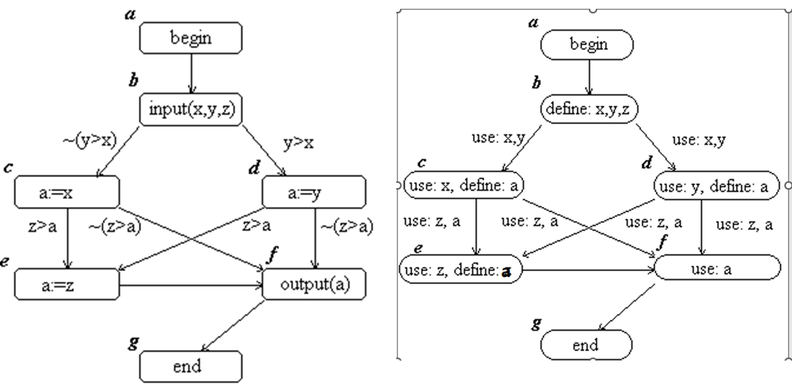
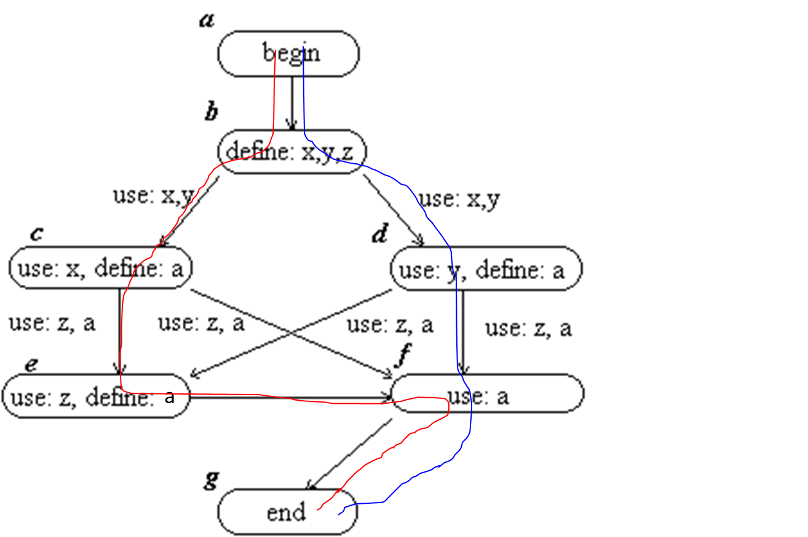
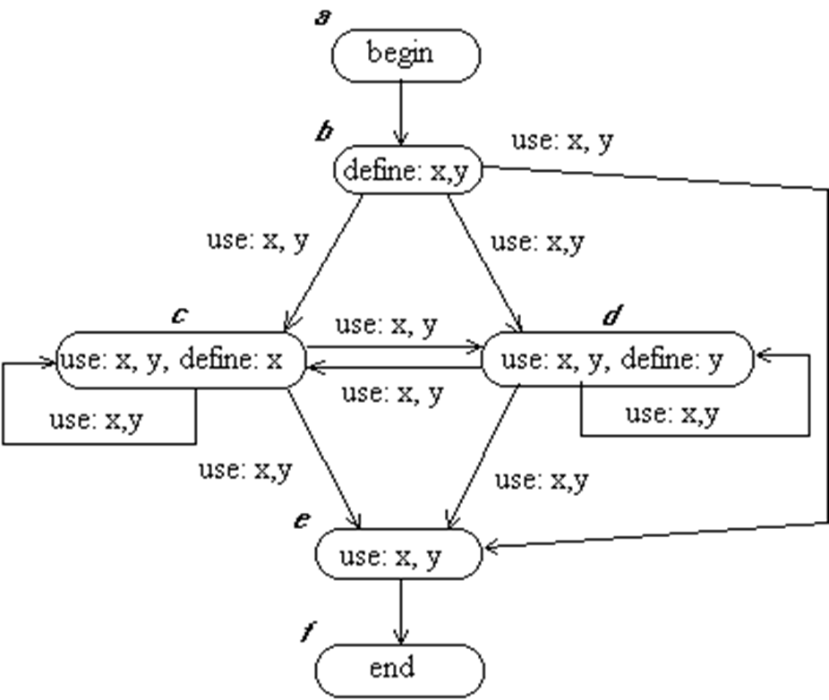
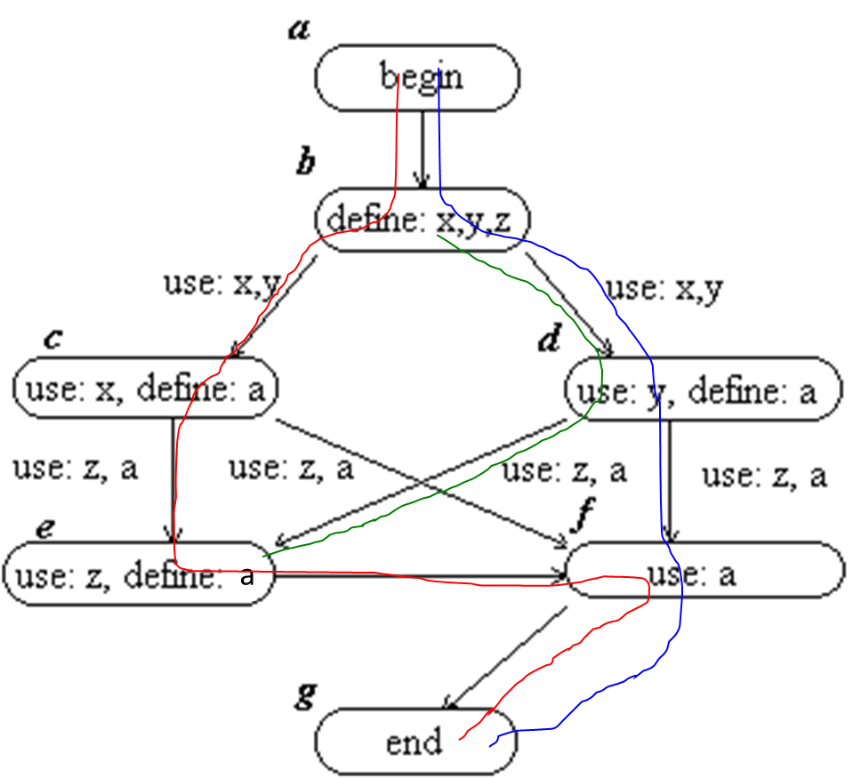
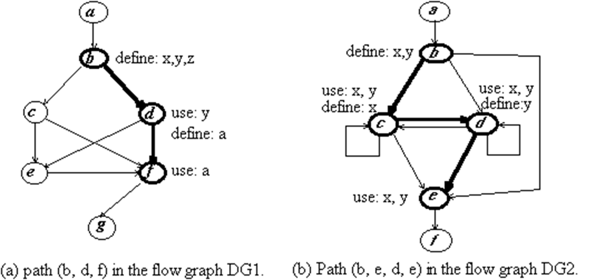
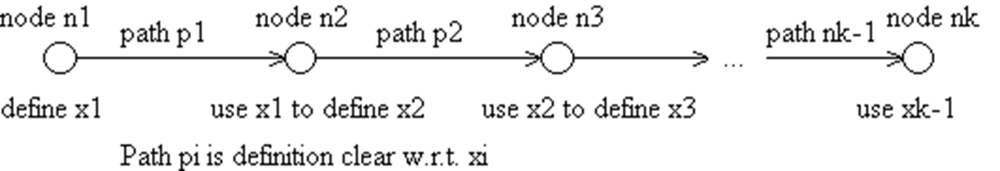

# Basic Ideas of Data Flow Testing

Data flow testing concerned with the correctness of processing data in the program:

- Is the code using the right data? -- *the ways that values are associated with variables*
- Is the data processed correctly? -- *the ways that these associations affect the execution of the program* 

The approach is to check the paths that show how the data flow in the program

- Data flow information are introduced into the flow graph model 
- The paths to be tested are defined in terms of such data flow information

1. 主要关注点:
- 数据流测试主要关注程序中数据处理的正确性，包括两个核心方面：
  1. 代码是否使用了正确的数据 - 这涉及变量如何与值相关联
  2. 数据是否被正确处理 - 这涉及这些关联如何影响程序的执行

2. 测试方法:
- 核心方法是检查程序中的数据流路径，具体包括：
  1. 将数据流信息整合到流程图模型中
  2. 基于数据流信息定义需要测试的路径
  3. 设计测试用例来验证这些数据流路径

3. 与控制流测试的区别：
- 控制流测试关注程序执行的路径和逻辑分支
- 数据流测试关注数据在程序中如何被定义、使用和处理
- 数据流测试可以帮助发现控制流测试可能遗漏的数据处理错误

**（重点）**Why do we need to study data flow testing?

Goal:Try to ensure that values are computed and used correctly

数据流测试可以解决以下4个关键问题：

未使用的变量问题

- 当变量被定义但从未被使用时
- 这可能表明代码中存在冗余或遗漏的逻辑

未定义变量问题

- 当变量在被使用前没有适当的定义
- 这可能导致程序运行时错误或不可预测的行为

重复定义问题

- 当变量在使用前被多次定义
- 这可能导致数据不一致或难以追踪的逻辑错误

提前释放问题

- 当变量在使用前就被释放
- 这可能导致访问无效内存或空引用错误

# Data Flow Information

Variable occurrences in a program are classified into

## definition occurrence:

* where a value is bound to the variable, i.e. defined

## use occurrence:

* where the value of the variable is referred to, i.e. used

## predicate use: (p-use)

* where the value of a variable is used to decide whether a predicate is true for selecting an execution path

## computation use: (c-use)

* where the value of a variable is used to compute a value for defining other variables, or as an output value

定义出现(Definition Occurrence):

- 这是变量被赋值的地方
- 例如：`x = 5` 或 `count = 0`
- 在这里，变量获得了一个具体的值

使用出现(Use Occurrence):
分为两种类型：

A. 谓词使用(Predicate Use/p-use):
- 变量用于控制程序流程的决策
- 出现在条件语句中
- 例如：
  ```python
  if (x > 0):  # x的谓词使用
      doSomething()
  ```

B. 计算使用(Computation Use/c-use):
- 变量用于计算其他值或作为输出
- 出现在赋值语句右边或输出语句中
- 例如：
  ```python
  y = x + 1  # x的计算使用
  print(x)   # x的计算使用
  ```

## Example

The following program computes the greatest common divisor of two natural numbers using Euclid's algorithm

```
Begin
		input(x,y);
		while (x>0 and y>0) do
			if (x>y) 
			then x:=x-y 
			else y:=y-x endif
		endwhile;
		output(x+y)
	End
```

1. 定义出现(Definition Occurrences):

程序的数据流分析：
1. 变量x和y在程序开始时被定义
2. 它们在循环和条件判断中被用作谓词使用
3. 在循环体内被用于计算并重新定义
4. 最终在输出语句中被用于计算



左侧 - 控制流图(Control Flow Graph):
- 显示程序的执行路径和控制结构
- 包含条件判断如 `y>x`, `z>a` 等
- 显示赋值操作如 `a:=x`, `a:=y`, `a:=z`
- 清晰地展示了程序的执行顺序和分支结构

右侧 - 数据流图(Data Flow Graph):
- 显示变量的定义和使用关系
- 使用 "define" 标注变量的定义点
- 使用 "use" 标注变量的使用点
- 展示了变量之间的依赖关系
- 显示了数据如何在程序中流动和传递

两个图的对应关系：
- 节点用字母(a-g)标记，在两图中保持一致
- 左图中的每个操作在右图中都有对应的数据流表示
- 右图更关注数据的定义-使用关系，而不是控制流程

数据流图中的各种变量出现(occurrences)：

1. 定义出现(Definition Occurrences):

- 节点b：定义了变量 x, y, z
- 节点c：定义了变量 a (a:=x)
- 节点d：定义了变量 a (a:=y)
- 节点e：定义了变量 a (a:=z)

2. 谓词使用(p-use):

- 边b→c和b→d的分支上：x和y的p-use (用于条件判断y>x)
- 从c和d到e和f的边上：z和a的p-use (用于条件判断z>a)

3. 计算使用(c-use):

- 节点c：x的c-use (用于计算a的值)
- 节点d：y的c-use (用于计算a的值)
- 节点e：z的c-use (用于计算a的值)
- 节点f：a的c-use (用于输出)

整体数据流：
1. x、y、z在程序开始时被定义
2. x和y被用于决定流程方向
3. a在不同的路径上被多次定义（使用x、y或z）
4. z和a在多个地方被使用于判断条件
5. 最后a被用于输出

# Data Flow Concepts

**Definition-clear path** with respect to a variable x:

-  a path that for all nodes in the path there is no definition occurrence of the variable x. 

A definition of variable *x* at node *u* **reaches** the computational use occurrence of *x* at node *v* through the path *p*: 

- Variable x has a definition at u
- Variable x has a computational use at v 
- p = (u, w1, w2,..., wn, v) is a path from u to v 
- (w1,w2,...,wn) is definition-clear with respect to x

A definition of variable x at u **reaches** a predicate use of x on the edge (wn,v) through path p: 

- Variable x has a definition at u
- p=(u, w1, w2,..., wn, v) is a path from u to v, 
- (w1, w2,..., wn) is definition-clear with respect to x, 
- Variable x has a predicate use occurrence on the edge from wn to v, 

If the path p in the above definitions are feasible, we say a definition **feasibly** *reaches* a use of the definition.

（这个概念是真nm抽象！！）

1. 定义清晰路径(Definition-clear path)：
- 对于变量x，如果路径上的所有节点都不包含x的定义，则称该路径是关于x的定义清晰路径
- 简单说，就是一条路径上没有重新定义该变量

2. 到计算使用的可达性(Reaches computational use)：
当满足以下条件时，变量x的定义从节点u可达到节点v的计算使用：
- 在节点u处有x的定义
- 在节点v处有x的计算使用
- 存在从u到v的路径p = (u, w₁, w₂,..., wₙ, v)
- 中间路径(w₁,w₂,...,wₙ)是x的定义清晰路径

3. 到谓词使用的可达性(Reaches predicate use)：
当满足以下条件时，变量x的定义从节点u可达到边(wₙ,v)的谓词使用：
- 在节点u处有x的定义
- 存在路径p = (u, w₁, w₂,..., wₙ, v)
- 中间路径(w₁,w₂,...,wₙ)是x的定义清晰路径
- x在从wₙ到v的边上有谓词使用

4. 可行到达(Feasibly reaches)：
- 如果上述路径p是可执行的，则称定义"可行地到达"使用点
- 这表示这条路径在实际执行中是可能发生的

# Testing Definition-Use Associations

## Definition coverage criterion

> 从一个变量的definiton occurence出发 至少到达一个use occurrence就够了

A set *P* of complete paths satisfies *definition coverage criterion*, if for all definition occurrences of a variable *x*, there exists at least one path *p* in *P* such that *p* contains a subpath through which the definition of *x* feasibly reaches **a** use occurrence (*Includes both p-use and c-use*) of *x*. 

*Testing* **every** **definition** *of* **every** **variable** *by checking just* **one** **use** *of the definition.* 

Definition coverage criterion的关键要点：

1. 覆盖要求：
- 对于程序中每个变量的每个定义点
- 至少要有一条路径
- 该路径能从定义点(definition occurrences )到达该变量的某个使用点（可以是p-use或c-use）

2. 重要特征：
- 只要求检查每个定义的"一个"使用点
- 不需要覆盖同一个定义到所有可能使用点的路径
- 包括谓词使用(p-use)和计算使用(c-use)

3. 路径要求：
- 必须是可行路径(feasible paths)
- 路径必须是完整的(complete paths)
- 定义必须能通过这条路径"可行地到达"(feasibly reaches)使用点

4. 最小充分条件：
- 每个变量的每个定义
- 至少被一个使用点测试到
- 通过至少一条完整的路径

简单来说： "对每个变量的每个定义，我们至少需要测试到它的一个使用点"

示例： 如果变量x在节点A被定义，并在节点B和C都有使用，那么：

- 只需要测试从A到B或从A到C的一条路径
- 不需要同时测试两条路径
- 这是最基本的数据流测试要求

### Example



The set {p1, p2} satisfies the definition coverage criteria. 

•p1=(a, b, c, e, f, g) 

•p2= (a, b, d, f, g)

路径p₁ = (a, b, c, e, f, g)：
- 红色标记的路径
- 覆盖了通过节点c的执行流程
- 验证了变量x的定义-使用链条
- 从变量定义(节点b)到其使用点(节点c、f)

路径p₂ = (a, b, d, f, g)：
- 蓝色标记的路径
- 覆盖了通过节点d的执行流程
- 验证了变量y的定义-使用链条
- 从变量定义(节点b)到其使用点(节点d、f)

为什么这两条路径满足定义覆盖标准：
1. 对于节点b中定义的变量x：
   - 通过p₁路径可以到达其使用点
   - 满足了x的定义-使用关联

2. 对于节点b中定义的变量y：
   - 通过p₂路径可以到达其使用点
   - 满足了y的定义-使用关联

3. 对于变量z：
   - 两条路径都包含了从其定义到使用的路径

4. 对于变量a：
   - 两条路径覆盖了a的不同定义点到其使用点的路径

这个例子很好地说明了定义覆盖标准只需要每个变量的每个定义至少能到达一个使用点即可。

## Use Coverage Criterion

> 有可能一个变量定义了不止使用一次 
>
> 而适用于Use Coverage的用例就是要必须覆盖变量在data flow所有的使用点

**Definition** (*Use coverage criterion*)

A set *P* of complete paths satisfies *use coverage criterion*, if for all definition occurrences of a variable *x*, and **all** use occurrences of *x* that the definition feasibly reaches, there is at least one path *p* in *P* such that *p* contains a subpath through which that definition feasibly reaches the use. 

*Testing* **every** **definition** *of* **every** **variable** *by checking* **every** **use** *of the definition through* **one feasible path***.* 

Use Coverage Criterion以及它与Definition coverage criterion的区别：

关键区别：
1. Definition coverage criterion：每个定义只需要到达"一个"使用点
2. Use Coverage Criterion：每个定义必须到达"所有"它能到达的使用点

Use Coverage Criterion的要求：
1. 对于每个变量x的每个定义点
2. 对于这个定义能到达的每个使用点
3. 必须至少有一条从定义到使用的可行路径
4. 路径必须是完整的程序路径（从开始到结束）

举例说明：
假设变量x在某点被定义，且有3个使用点可以从该定义点到达：
- Definition coverage criterion：只需要测试到其中任意一个使用点的路径
- Use Coverage Criterion：需要测试到所有3个使用点的路径（每个使用点至少一条路径）

更严格的要求：
- 使用覆盖比定义覆盖更严格
- 需要更多的测试用例
- 提供更全面的测试覆盖
- 能发现更多潜在问题

这种标准有助于：
1. 确保每个定义的所有可能使用都被测试到
2. 发现数据流中的隐藏问题
3. 提供更全面的测试保证

### Example



Three nodes have definition occurrences of variables: b, c, d.

**The definition of the variable x at node b reaches** 

- The computation uses of x at nodes c, d and e
- The predicate uses on the edges (b, c), (b, d), (b, e), (d, c), and (d, d).

**The definition of the variable y at the node b reaches** 

- The computation uses of y at nodes c, d, and e, 
- The predicate uses on the edges (b, c), (c, c), (b, d), (b, e), (c, d), and (c, e).

**The definition of x at node c reaches** 

- The computation uses of x at nodes c, d, and e, 
- The predicate uses on the edges (c, d), (c, c), (c, e), (d, d), and (d, e).

**The definition of y at node d reaches** 

- The computation uses of y at nodes c, d, and e, 
- The predicate uses of y on the edges (d, c), (c, c), (c, d), (d, d), and (d, e).

1. 定义点(Definition Occurrences)位于三个节点：
- 节点b：定义了x和y
- 节点c：定义了x
- 节点d：定义了y

2. 对于节点b中x的定义：
- 计算使用(c-use)：在节点c、d和e中
- 谓词使用(p-use)：在边(b,c)、(b,d)、(b,e)、(d,c)和(d,d)上

3. 对于节点b中y的定义：
- 计算使用(c-use)：在节点c、d和e中
- 谓词使用(p-use)：在边(b,c)、(c,c)、(b,d)、(b,e)、(c,d)和(c,e)上

4. 对于节点c中x的定义：
- 计算使用(c-use)：在节点c、d和e中
- 谓词使用(p-use)：在边(c,d)、(c,c)、(c,e)、(d,d)和(d,e)上

5. 对于节点d中y的定义：
- 计算使用(c-use)：在节点c、d和e中
- 谓词使用(p-use)：在边(d,c)、(c,c)、(c,d)、(d,d)和(d,e)上

这个例子展示了一个比较复杂的数据流场景，其中：
- 变量有多个定义点
- 每个定义点都能到达多个使用点
- 同时包含计算使用和谓词使用
- 存在循环结构（如(c,c)和(d,d)这样的边）

## DU-Path Coverage Criterion

> 到达和覆盖definition occurrence和use occurrence的同时，也需要覆盖从definiton到use之间所有可能的路径

**Definition** (*Definition-use path coverage*) 

A set *P* of complete paths satisfies *DU path coverage criterion*, if for all definitions of a variable *x*, and **all** feasible paths *q* through which that definition reaches a use of *x*, and *q* is cycle-free or contains only simple cycles, there is at least one path *p* in *P* such that *q* is a subpath of *p*.

*Testing* **every** **definition** *of* **every** **variable** *by checking* **every** **use** *of the definition through* every feasible path from the definition to the use.

DU-Path Coverage(定义-使用路径覆盖)是比Use Coverage更严格的标准，让我解释其关键区别：

1. 主要区别：
- Definition Coverage: 每个定义到达任意一个使用点
- Use Coverage: 每个定义到达所有使用点，每个使用点至少一条路径
- DU-Path Coverage: 每个定义到达所有使用点，且覆盖所有可行路径

2. DU-Path Coverage的特殊要求：
- 必须覆盖从定义到使用的每条可行路径
- 路径必须是无循环或只包含简单循环
- "简单循环"指循环最多执行一次

3. 举例说明：
```
节点A: x = 5        // 定义点
if (condition1)     // 路径1开始
    y = x + 1      // 使用点1
else               // 路径2开始
    y = x + 2      // 使用点2
```

覆盖要求：
- Definition Coverage: 只需要测试路径1或路径2
- Use Coverage: 需要测试路径1和路径2各一次
- DU-Path Coverage: 必须测试所有可能的路径组合

这使得DU-Path Coverage成为三者中最严格的测试标准，但也需要更多的测试资源。

### Example: DU Path Coverage



The set {p1, p2} does not satisfy the DU path coverage criteria. 

- p1=(a, b, c, e, f, g) 
- p2= (a, b, d, f, g)

The path (b, d, e) :

- not covered by p1 and p2
- the definition of z at node b reaches the computational use of z at node e.

已有的路径：

- p₁ = (a, b, c, e, f, g)
- p₂ = (a, b, d, f, g)

问题所在：

1. 存在一条重要路径(b, d, e)未被覆盖
2. 这条路径很重要因为：
   - 节点b定义了变量z
   - 节点e使用了z（计算使用）
   - 这构成了一个定义-使用对

DU-Path Coverage要求：

- 必须覆盖从每个定义点到每个使用点的所有可能路径
- 在这里，从b点（z的定义点）到e点（z的使用点）存在多条可能路径：
  - 路径1：b -> c -> e (p₁覆盖了)
  - 路径2：b -> d -> e (未被覆盖)
  - 路径3： c -> f

## Difference

Definition Coverage：

- "只要能从A城市到达B城市就行，随便走哪条路"
- 只需要确保有一条路径能到达

Use Coverage：

- "必须到达B城市的所有地标(使用点)"
- 每个地标至少要去一次，不在乎走哪条路

DU-Path Coverage：

- "必须探索从A城市到B城市的所有可能路径"
- 每个地标都要去
- 而且必须通过所有可能的路线去

## Subsumption Relations

All du path coverage criterion subsumes all uses coverage criterion

All uses coverage criterion subsumes all definition coverage criterion

All uses coverage criterion subsumes branch coverage criterion

这里解释了这三个覆盖标准之间的包含关系(subsumption relation)：

1. DU-Path Coverage 包含 Use Coverage
- 原因：
  * DU-Path Coverage要求覆盖从定义到使用的所有可能路径
  * Use Coverage只要求到达所有使用点
  * 如果覆盖了所有路径，自然也就覆盖了所有使用点

2. Use Coverage 包含 Definition Coverage
- 原因：
  * Use Coverage要求到达所有使用点
  * Definition Coverage只要求到达任意一个使用点
  * 覆盖所有使用点必然包含覆盖至少一个使用点

3. Use Coverage 包含 Branch Coverage(分支覆盖)
- 原因：
  * Use Coverage需要覆盖所有p-use(谓词使用)
  * p-use出现在条件判断/分支处
  * 要覆盖所有p-use，必然要覆盖所有分支

这种包含关系说明：
- DU-Path Coverage 是最严格的标准
- Use Coverage 处于中间水平
- Definition Coverage 和 Branch Coverage 要求较低

这也意味着：
- 通过DU-Path Coverage的测试用例一定能通过其他标准
- 但反过来不一定成立

# Testing Interactions Between Variables



An effective way to test the correctness of the data assigned to a variable is to check the process that the data are propagated. [Ntafos, 1984] 

1. DG1中的路径(b, d, f)演示了：
- 节点b：定义了变量x, y, z
- 节点d：使用y并定义了变量a
- 节点f：使用变量a

这展示了一个数据传播链：
```
b(定义y) -> d(使用y,定义a) -> f(使用a)
```

2. DG2中的路径(b, c, d, e)演示了：
- 节点b：定义x和y
- 节点c：使用x,y并定义新的x
- 节点d：使用x,y并定义新的y
- 节点e：使用x,y

这展示了一个更复杂的数据传播链：
```
b(定义x,y) -> c(使用x,y,定义新x) -> d(使用x,y,定义新y) -> e(使用x,y)
```

这两个例子说明：
- 变量的值可以通过多个节点传播
- 一个变量的值可能影响其他变量的计算
- 变量之间存在相互依赖关系

## Interaction Chain

> 抽象之抽！！！

A k-du **interaction chain** is a sequence of nodes [*n*1, *n*2,..., *$n_k$*], *k*>1, such that For each *i* in (1, 2*, …, k*-1), 

There is a path $P_i$ that from node $n_i$ to $n_{i-1}$ 

On node $n_{i}$, there is a definition of a variable $n_{}$.

On node $n_{i+1}$, there is c-use of $x_i$ to define variable  $x_{i+1}$.

The definition of $x_i$ on node *$n_{i}$* reaches the c-use of $x_i$ on node $n_{i+1}$ through path  $P_i$.

*The variables and the nodes do not need to be distinct.*



The concatenation of p1, p2,..., pk is called an *interaction path* for the k-du-interaction chain. 

k-du交互链的基本要求：
1. 是一个k个节点的序列(k>1)
2. 对相邻节点$n_i$和$n_{i+1}$:
   - 在$n_i$定义变量$x_i$
   - 在$n_{i+1}$使用x_i来定义新变量$x_{i+1}$
   - 存在一条从$n_i$到$n_{i+1}$的路径$p_i$
   - p_i是关于$x_i$的定义清晰路径(definition-clear)

重要特点：
1. 变量不需要互不相同
   - 比如$x_1$和$x_3$可以是同一个变量
2. 节点不需要互不相同
   - 同一个节点可以在链中出现多次

交互路径(Interaction Path)：
- 是所有路径p_1, p_2, ..., $p_{k-1}$的连接
- 表示了整个数据流动的完整路径

例子：
```
节点1: x = 5         // 定义x1
节点2: y = x + 1     // 使用x1定义x2(y)
节点3: z = y * 2     // 使用x2(y)定义x3(z)
```
这构成了一个3-du交互链：
- n1定义x传递给n2
- n2使用x定义y传递给n3
- n3使用y定义z

（？？？后面的好像不考了？）