# Fault-Based SW Testing Methods

**Basic Ideas of Fault-based Testing**

- Test cases are selected in order to detect a set of known (or potential) faults 
- 测试用例选择原则：
  - 测试用例的选择是有针对性的，目的是发现已知或潜在的故障
  - 不是随机选择测试用例，而是基于对可能出现的故障的分析来选择
- Test adequacy are measured according to the test set’s ability to detect a set of known or potential faults
- 测试充分性度量：
  - 测试的充分性不是通过覆盖率来衡量
  - 而是通过测试集检测已知或潜在故障的能力来衡量
  - 这提供了一个更直接的质量评估方法
- Using statistical inferences, one can estimate the number of faults remaining in the sw.
- 统计推断应用：
  - 使用统计方法来估计软件中剩余的故障数量
  - 这种方法可以帮助评估软件的质量状态
  - 为决定是否需要继续测试提供科学依据

*Fault-based testing assesses the system's ability to detect, tolerate, and recover from these issues by intentionally introducing faults, errors, or anomalies.*

系统评估方法：

- 通过主动引入故障、错误或异常来评估系统
- 评估系统三个关键能力：
  - 检测能力：能否发现故障
  - 容忍能力：能否在故障存在的情况下继续运行
  - 恢复能力：能否从故障状态中恢复

## Fault-Based Testing

**Why do we need to study Fault-Based Testing ?**

- Narrow down your error search as much as possible
- Achieve higher test efficiency and reduce test costs

缩小错误搜索范围：

- 通过有针对性地引入故障和错误
- 可以更快地定位问题所在
- 避免漫无目的的测试
- 提高故障检测的准确性

提高测试效率并降低成本：

- 通过有目的的测试用例设计
- 减少不必要的测试案例
- 节省测试时间和资源
- 提高投资回报率(ROI)

## Monte-Carlo Method

How many fishes are there in a pond? 

- Catch a few fishes in the pond, say 10. 
- Mark the fishes and return them to the pond. 
- Catch a few fish again the next day, say 12.
- Count how many of the fishes of the second catch are marked, say 3. 
- Can you estimate the total number of fishes in the pond? 

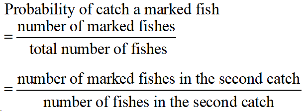

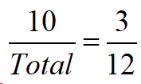

There are about 40 fishes in the pond. 

计算步骤：

1. 第一次捕捉：
- 捕获10条鱼
- 标记这些鱼
- 放回池塘

2. 第二次捕捉：
- 捕获12条鱼
- 其中3条是已标记的鱼

3. 概率计算原理：
- 在第二次捕捉中发现已标记鱼的概率 = 标记鱼数量/总鱼数
- 3/12 = 10/总数

4. 求解总数：
- 3/12 = 10/Total
- 12 × 10 = 3 × Total
- Total = (12 × 10)/3 = 40

所以，根据最大似然估计，池塘中大约有40条鱼。

## Error-Seeding

Artificial faults are planted into the program under test 

- in some suitable **random fashion** 
- **unknown** to the tester
- representative (*in terms of the difficulty to detect*) of the **inherent faults in the program** 

The software is tested such that 

- the inherent faults and seeded faults discovered are counted separately

  - Let *r* be the ratio of the number of seeded faults found to the total number of seeded faults. 

  - Let *f* is the number of inherent faults found by testing

The number of inherent faults in the program is predicted to be *f*/*r*

The ratio *r* also used to measure software test adequacy 

1. 错误播种的基本步骤：
- 向被测试程序中植入人工故障
- 这些故障要按照检测难度随机分布
- 测试人员不知道具体植入了哪些故障
- 这些人工故障要能代表程序中的固有故障

2. 测试执行：
- 分别统计发现的**固有故障**和**播种故障**
- 计算故障发现率：
  * r = 发现的播种故障数 / 总播种故障数
  * f = 发现的固有故障数

3. 故障预测：
- 预测程序中的固有故障总数 = f/r
- 例如：
  * 如果发现了50个固有故障(f=50)
  * 播种故障的发现率是80%(r=0.8)
  * 则预计总固有故障数 = 50/0.8 = 62.5个

4. 测试充分性：
- 使用r值来衡量测试的充分程度
- r值越高，说明测试越充分
- 可以用来决定是否需要继续测试

这种方法类似于之前讲的蒙特卡洛方法中的鱼塘估算，通过已知样本来推测总体。

## Analysis of The Error-Seeding Technique

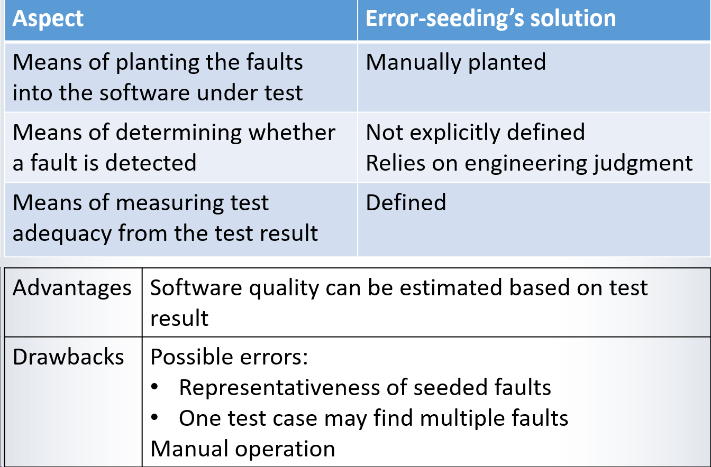

1. 故障植入方式：
- 采用手动植入方式
- 这意味着需要人工干预
- 可能存在主观性问题

2. 故障检测判定：
- 没有明确的判定标准
- 依赖工程师的专业判断
- 这可能导致判断的不一致性

3. 测试充分性度量：
- 有明确的度量方法
- 使用故障发现率(r)来衡量
- 提供了量化的评估标准

4. 优势：
- 可以基于测试结果估计软件质量
- 提供了定量的质量评估方法
- 有助于了解软件的整体质量状况

5. 缺点：
- 播种故障的代表性问题
  * 人工植入的故障可能不能真实反映实际故障
- 故障检测的重叠问题
  * 一个测试用例可能发现多个故障，影响统计准确性
- 手动操作的局限性
  * 耗时耗力
  * 可能存在人为偏差
  * 难以大规模应用

## Mutation Testing

Generation of mutants

- Construction of a collection of alternative programs (called **mutants**) (*that* *each differs from the original program in one place*) by applying a set of operators (called **mutation operators**) 

Each mutant is then executed on each test case in the test set *T* 

- If there is at least one test case in *T* on which the original program *P* and a mutant program produce different responses: **the mutant is** **dead****,** or **killed** **by the test case**
- If on all test cases in *T*, the original and the mutant produces same result: **the mutant remains** **alive**

让我解释变异测试(Mutation Testing)的核心概念：

1. 变异体的生成：
- 创建一系列的程序变体(变异体)
- 每个变异体只在一个地方与原程序不同
- 使用变异算子来产生这些变化
- 变异必须是有意义的程序变化

2. 变异体的执行：
- 对每个变异体执行完整的测试用例集(T)
- 比较变异体和原程序在每个测试用例上的输出

3. 变异体的状态判定：
- "死亡"(killed)变异体：
  * 至少有一个测试用例使变异体产生与原程序不同的输出
  * 这说明测试用例成功检测到了这个变化
  
- "存活"(alive)变异体：
  * 在所有测试用例上都产生与原程序相同的输出
  * 这可能表明测试集不够强大，或变异体与原程序等价

4. 变异测试的优点：
- 自动化程度高
- 可以系统地评估测试用例的有效性
- 能发现测试集的弱点

5. 实际应用考虑：
- 需要合理设计变异算子
- 需要处理等价变异体的问题
- 需要高效的执行策略

### Live Mutants

A mutant may remain alive for one of two reasons:

- The test data is inadequate.
  - Test data cannot detect the fault 

- The mutant is equivalent to the original program.
  - Equivalent mutants should discarded

活着的变异体(Live Mutants)是指在变异测试过程中没有被"杀死"的变异程序。变异体存活的原因有两种：

1. 测试数据不充分：
- 现有的测试用例无法检测出该变异引入的故障
- 这表明测试集的质量可能不够好
- 需要设计新的测试用例来提高测试覆盖率
- 这种情况下应该增加或改进测试用例

2. 等价变异体：
- 变异后的程序与原程序在功能上完全等价
- 即使测试数据再完善，也无法区分它们的行为
- 这类变异体应该被识别并从分析中排除
- 因为它们不代表真正的程序缺陷

处理建议：
- 对于第一种情况：需要改进测试用例集
- 对于第二种情况：需要识别并移除等价变异体
- 区分这两种情况对于准确评估测试效果很重要

### Mutation Score 

**Definition** 

The *mutation adequacy* of a set of test data is measured by a numerical score calculated according to the following equation:

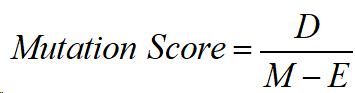

where 

- *D* is the number of dead mutants, 
- *M* is the total number of mutants, 
- *E* is the number of equivalent mutants.(The number of mutants that remain undetected by the tests due to equivalent mutations.)

When E=0 (All mutants are detected) the mutation score approaches 1, it indicates that the test can effectively detect erroneous mutations within the program, thereby indicating higher program robustness and test coverage.

1. 变异分数的计算公式：
```
Mutation Score = D / (M - E)

其中：
D = 死亡的变异体数量
M = 总的变异体数量
E = 等价变异体数量
```

2. 各参数的含义：
- D (Dead Mutants): 被测试用例检测出来的变异体数量
- M (Total Mutants): 通过变异算子生成的所有变异体数量
- E (Equivalent Mutants): 与原程序功能等价的变异体数量
- (M-E)实际上代表有效的变异体总数

3. 分数的意义：
- 分数范围在0到1之间
- 分数越接近1，说明测试效果越好
- 当E=0时（没有等价变异体），分数接近1表示：
  * 测试用例能有效检测程序中的错误
  * 程序具有较高的健壮性
  * 测试覆盖率较好

4. 示例计算：
```
假设：
- 总共生成了100个变异体(M=100)
- 其中10个是等价变异体(E=10)
- 80个变异体被测试杀死(D=80)

变异分数 = 80/(100-10) = 80/90 ≈ 0.89
```

变异分数是一个重要的衡量标准，它能够量化地表示测试用例发现程序错误的能力。

### Mutation Operators

A mutation operator is a syntactic transformation which produces a mutant when applied to the program under test. 

- Each operator applies to a certain type of syntactic structure in the program
- It replaces a fragment of program code with a “*non-equivalent*” one
- It models a type of faults that may be in the program

Example

- Replace the expression "a>b" with "a<b" , or "a=b", or "a≤b", or "a≥b", or "a≠b" 

基本定义：

- 变异算子是一种语法转换工具
- 它用来生成程序的变异体
- 每个变异只改变程序的一个部分

2. 三个重要特征：
- 针对特定语法结构：每个算子只处理特定类型的代码结构
- 生成非等价代码：替换后的代码应与原代码在功能上有所不同
- 模拟实际错误：模拟程序员可能犯的错误类型

3. 具体示例说明：
对于表达式 "a>b"，变异算子可以生成以下变体：
```java
a > b  // 原始代码
a < b  // 变异体1：反向比较
a = b  // 变异体2：变成相等比较
a ≤ b  // 变异体3：增加等于的情况
a ≥ b  // 变异体4：增加等于的情况
a ≠ b  // 变异体5：变成不等比较
```

这个例子展示了一个变异算子如何通过系统地修改比较运算符来生成不同的变异体，每个变异体都代表了一种可能的编程错误。

### Example 1 of Mutant

Original Program

```
Procedure Greatest-Common-Divisor; 
	var x, y: integer; 
	begin 
		input (x,y); 
		while (x>0 and y>0) do 
			if (x>y) 
			then x:= x-y 
			else y:= y-x 
			endif 
		endwhile; 
		output (x+y); 
end 

```

Mutant

```
Procedure Greatest-Common-Divisor; 
	var x, y: integer; 
	begin 
		input (x,y); 
		while (x>0 and y>0) do 
			if (x<y) 	
			then x:= x-y 
			else y:= y-x 
			endif 
		endwhile; 
		output (x+y); 
end 

```

- 变异算子应用在条件判断处：
- 原程序：`if (x>y)`
- 变异后：`if (x<y)`
- 这是一个关系运算符变异，把"大于"变成了"小于"

### Types of Mutation Operators

1. 基本数据和表达式变异：
- Coincidental Correctness Analysis（巧合正确性分析）
  - 目标：防止程序偶然正确
  - 操作：改变数据引用和表达式中的运算符
  
2. 数据相关变异：
- Domain Analysis（域分析）
  - 目标：测试不同数据域
  - 操作：对常量和子表达式做小幅度改变
  
3. 逻辑和控制流变异：
- Predicate Analysis（谓词分析）
  - 目标：测试边界条件
  - 操作：修改条件判断和循环限制
- Statement Analysis（语句分析）
  - 目标：确保分支覆盖和语句必要性
  - 操作：替换或修改语句类型

4. 面向对象特性变异：
- Class Encapsulation Analysis（类封装分析）
  - 目标：测试封装正确性
  - 操作：修改访问修饰符（private/public等）
- Inheritance Analysis（继承关系分析）
  - 目标：测试继承关系
  - 操作：修改重写方法、Super关键字等

5. 高级特性变异：
- Polymorphism Analysis（多态分析）
  - 目标：测试多态行为
  - 操作：改变对象实例化类型、修改方法重载
- Language Specific Analysis（语言特性分析）
  - 目标：测试语言特定功能
  - 操作：修改特定关键字（如Java的this、static）

6. 接口变异：
- Interface Analysis（接口分析）
  - 目标：确保组件间接口正确
  - 操作：修改函数调用、参数和模块间通信

每种变异类型都针对特定的测试目标，通过系统地改变代码来发现潜在问题。

### Analysis of The Mutation Testing Technique

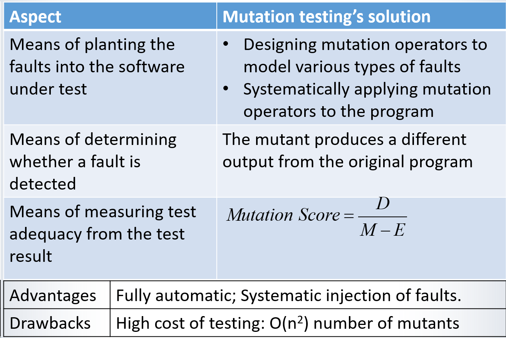

1. 故障植入方式：
- 通过设计变异算子来模拟各种类型的故障
- 系统地将变异算子应用到程序中
- 这是一个自动化的过程，不像错误播种那样需要手动操作

2. 故障检测方法：
- 通过比较变异体和原程序的输出来判断
- 如果输出不同，说明故障被检测到（变异体被杀死）
- 判断标准明确，不依赖工程师的主观判断

3. 测试充分性度量：
- 使用变异分数(Mutation Score)来衡量
- 计算公式：D/(M-E)
  * D：死亡的变异体数量
  * M：总变异体数量
  * E：等价变异体数量

4. 优势：
- 完全自动化，减少人工干预
- 系统化的故障注入，覆盖面广
- 客观的评估标准
- 可重复性强

5. 缺点：
- 测试成本高
- 变异体数量是O(n²)级别的
- 随着程序规模增大，测试成本急剧上升
- 需要处理等价变异体问题

相比错误播种方法，变异测试更加系统化和自动化，但计算成本也更高。

# Error-Based Testing

**Basic idea**

To check program on error-prone cases to ensure such errors are not repeated

**Known common errors**

- Boundary error: 
  - Incorrect division of the input space into sub-domains 
- Functional error:
  - Incorrect expression of computation (the function) for a sub-domain of the input space

- Commission error:
  - Do things that are unnecessary
- Omission error:
  - Failed to do something that should have been done

*Error-based testing focuses on verifying if the system's functionality and behavior under normal conditions are correct.*

1. 基本思想：
- 在容易出错的情况下测试程序
- 防止已知错误的重复发生
- 关注系统在正常条件下的功能和行为

2. 四种常见错误类型：

a) 边界错误（Boundary Error）：
- 输入空间划分不正确
- 例如：
  * 数组边界处理不当
  * 临界值判断错误
  * 范围划分不准确

b) 功能错误（Functional Error）：
- 子域中的计算表达式错误
- 例如：
  * 计算公式写错
  * 业务逻辑实现错误
  * 算法实现不正确

c) 多余错误（Commission Error）：
- 做了不必要的事情
- 例如：
  * 多余的检查
  * 不必要的计算
  * 冗余的处理逻辑

d) 遗漏错误（Omission Error）：
- 漏做了应该做的事情
- 例如：
  * 未进行必要的验证
  * 遗漏某些处理步骤
  * 忽略了某些特殊情况

## Concept

Error

- Human mistake made in the development and operation of the system
- These errors may stem from misunderstandings, negligence, mistakes in operation, or misunderstanding of system requirements.

Fault

- The defects in the system 
- They are actual problems within the system, potentially stemming from design errors, programming mistakes, or issues during implementation.

Failure 

- The behaviour of a faulty system during execution that does not meet the expectation
- Caused by faults in the system

让我解释软件测试中的三个重要概念及其关系：

1. Error（错误）：
- 是人为的错误
- 发生在开发和操作阶段
- 产生原因：
  * 需求理解错误
  * 工作疏忽
  * 操作失误
  * 系统理解偏差

2. Fault（故障）：
- 是系统中的缺陷
- 是错误在系统中的具体表现
- 来源包括：
  * 设计错误
  * 编程错误
  * 实现问题

3. Failure（失效）：
- 是系统运行时的不当行为
- 表现为不符合预期的结果
- 由系统中的故障导致

## Software defects

A software defect is any undesired or unacceptable deviation existing within software (documents, data, programs) that leads to quality issues in the software. It is classified as a software defect if it meets any one of the following five criteria:

1. The software fails to meet the functionalities specified in the software specification document.
2. The software exceeds the scope outlined in the software specification document.
3. The software does not achieve the objectives stated in the software specification document.
4. Errors occur during the execution of the software.
5. Software testers find the software challenging to understand, user-unfriendly, or running at a slow pace.

让我解释软件缺陷的定义和五个判断标准：

软件缺陷的定义：
- 是软件中任何不期望或不可接受的偏差
- 存在于软件的各个部分（文档、数据、程序）
- 会导致软件质量问题

五个判定标准（满足任一即可）：

1. 功能不完整：
- 未实现规格说明书中指定的功能
- 例如：要求支持导出PDF，但只实现了导出Word

2. 功能过度：
- 超出规格说明书定义的范围
- 例如：要求只读取数据，但程序还添加了修改功能

3. 目标未达成：
- 无法实现规格说明书中规定的目标
- 例如：要求处理时间不超过1秒，但实际需要3秒

4. 执行错误：
- 程序运行时出现错误
- 例如：程序崩溃、异常、计算错误

5. 用户体验问题：
- 程序难以理解
- 用户界面不友好
- 运行速度慢

## Common Boundary Errors

**Shift error**

The implemented boundary is a parallel shift from the correct boundary

**Rotation error**

The implemented boundary is a rotation of the correct boundary

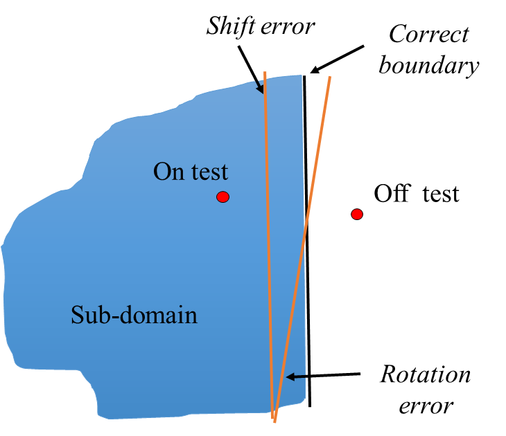

让我详细解释常见的边界错误类型和相关术语：

1. 边界错误的两种类型：

a) 平移错误 (Shift Error)：
- 实现的边界与正确边界平行但位置错误
- 类似整体移动了边界线
- 例如：
```java
// 正确的边界
if (age >= 18)   // 成年人标准

// 平移错误
if (age >= 19)   // 边界整体往上移动了一岁
```

b) 旋转错误 (Rotation Error)：
- 实现的边界与正确边界有角度偏差
- 边界线发生了旋转
- 例如：
```java
// 正确的边界
if (height/weight > 2.5)  // BMI标准

// 旋转错误
if (height > weight * 2.5)  // 关系表达式改变导致边界线旋转
```

2. 重要术语：

a) 输入空间维度 (Dimension of input space)：
- 指输入变量的数量
- 例如：处理X,Y坐标就是二维输入空间

b) 测试区分：
- On test（域内测试）：
  * 测试子域内的输入数据
  * 位于边界内的测试点

- Off test（域外测试）：
  * 测试子域外的输入数据
  * 位于边界外的测试点

- 蓝色区域代表测试的子域
- 红点表示测试点的位置
- 黑线表示实现的边界
- 橙线表示正确的边界

### Boundary Analysis

The purpose:

- To test if the boundary implemented by the software is correct

The method:

- Select test cases on the borders and near the borders

The basic assumptions:

- The software computes different function on points inside the sub-domain from the points outside the sub-domain
- Domain is divided into sub-domains by borders, which are simple, such as straight lines and planes
- Boundary errors are simple, such as shift errors and rotation errors 3

让我解释边界分析(Boundary Analysis)的三个关键方面：

1. 目的：
- 验证软件实现的边界是否正确
- 检测边界处理的准确性
- 确保边界条件的正确实现

2. 方法：
- 在边界上选择测试用例（边界值）
- 在边界附近选择测试用例（边界值附近）
例如：
```java
// 测试年龄限制
if (age >= 18) {
    // 边界上的测试：age = 18
    // 边界近处的测试：age = 17, age = 19
}
```

3. 基本假设：

a) 功能差异性：
- 子域内外的计算功能不同
- 例如：
```java
if (score >= 60) {
    return "Pass";    // 子域内的功能
} else {
    return "Fail";    // 子域外的功能
}
```

b) 边界简单性：
- 边界是简单的形式（直线、平面）
- 不考虑复杂的曲线边界
- 例如：
```java
// 简单边界
if (x <= 100 && y <= 100)

// 而不是复杂边界
if (x*x + y*y <= 10000)
```

c) 错误简单性：
- 只考虑简单的边界错误类型
- 主要是平移错误和旋转错误
- 不考虑复杂的边界变形

### Example: DISCOUNT INVOICE 

A company produces two goods, X and Y, with prices £5 for each X purchased and £10 for each Y purchased. An order consists of a request for a certain number of X's and a certain number of Y's. 

The cost of the purchase is the sum of the costs of the individual demands for the two products discounted as explained below. 

- If the total is greater than £200 a discount of 5% is given, 
- if the total is greater than £1000 a discount of 20% is given. 

Also the company wishes to encourage sales of X and give a further discount of 10% of the total cost, if more than thirty X's are ordered. 

Non-integer final costs are rounded down to give an integer value.

1. 基本价格计算：
- X产品：每个£5
- Y产品：每个£10
- 总价 = X数量 × £5 + Y数量 × £10

2. 折扣规则：

a) 基于总额的折扣：
```
if 总额 > £1000:
    折扣 = 20%
else if 总额 > £200:
    折扣 = 5%
else:
    折扣 = 0%
```

b) 基于X产品数量的额外折扣：
```
if X数量 > 30:
    额外折扣 = 10%
```

3. 特殊处理：
- 最终金额向下取整到整数

4. 可能的边界情况：
- 总额正好是£200
- 总额正好是£1000
- X产品数量正好是30个
- 有小数的情况

#### Process of Domain Analysis

Identification of function

- The function to be tested is the computation of the total amount of invoice for any given order

Identification of domain

- The input space consists of two inputs:
  - x: the number of product X ordered
  - y: the number of product Y ordered

- Both inputs are natural numbers {0,1, 2, …}

Identification of codomain

- The output is also a natural number that represents the amount of money in the unit of pounds. 

Analysis of functions

- Work out the relationship between the input and output 

If too complicated, then divide it!

1. 函数识别：
- 确定要测试的功能
- 在这个例子中是：计算给定订单的总金额
- 包括基础价格和各种折扣的计算

2. 域识别：
- 确定输入空间的特征
- 输入变量：
  * x：X产品的订购数量（自然数）
  * y：Y产品的订购数量（自然数）
- 输入范围：{0, 1, 2, ...}
- 这是一个二维的输入空间

3. 余域识别：
- 输出的特征
- 在这个例子中：
  * 输出是自然数
  * 表示最终价格（以英镑计）
  * 要求向下取整

4. 功能分析：
- 研究输入和输出的关系
- 如果太复杂可以分解成子功能：
```java
// 可以分解为：
totalAmount = calculateBasePrice(x, y)    // 基础价格
    .applyTotalDiscount()                 // 总额折扣
    .applyXQuantityDiscount()             // X数量折扣
    .roundDown();                         // 向下取整
```

#### Partitioning Input Space: Method 1 

When the inputs x and y have the property that x£ 30 and 5*x + 10* y £ 200, the output should be 5*x + 10*y. 

- Sub-function 1: 
  - Sub-Domain: A = {(x, y) | x £ 30, 5*x+10*y £ 200}
  - Relationship: sum = 5*x + 10* y

When the inputs x and y have the property that x ≤ 30 and 1000>5*x + 10* y > 200, the output should be ⌊(5x + 10y) * 95%⌋

- Sub-function 2: 
  - Sub-Domain: A = {(x, y) | x £ 30, 5*x+10*y > 200}
  - Relationship: sum =⌊(5x + 10y) * 95%⌋

 … 

让我解释这个基于规格说明的输入空间划分方法：

1. 基于规格说明的子域划分：

第一个子域（无折扣区域）：
```
Sub-Domain A：
条件：x ≤ 30 且 5x + 10y ≤ 200
计算公式：sum = 5x + 10y
```

第二个子域（5%折扣区域）：
```
Sub-Domain B：
条件：x ≤ 30 且 200 < 5x + 10y ≤ 1000
计算公式：sum = ⌊(5x + 10y) * 95%⌋
```

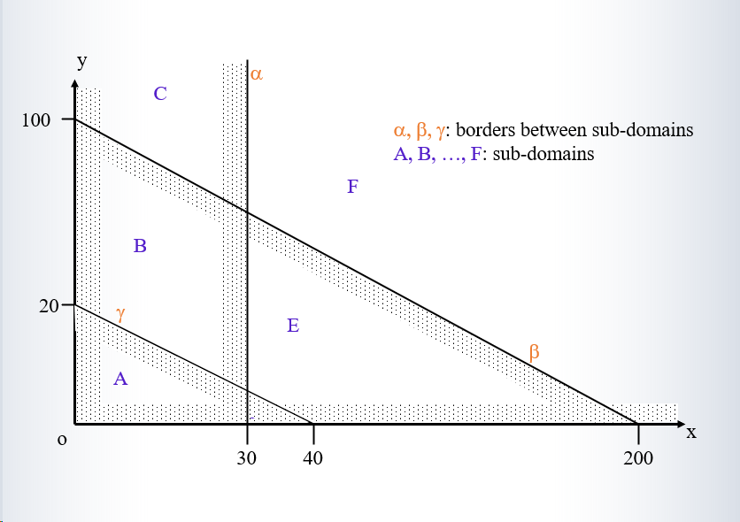

坐标系含义：
- x轴：X产品数量
- y轴：Y产品数量
- α, β, γ：子域之间的边界线

主要区域：

A区域：

- x < 30
- 总价较低（5x + 10y ≤ 200）
- 不享受任何折扣

B区域：

- x < 30
- 200 < 5x + 10y < 1000
- 享受5%折扣

C区域：

- x < 30
- 5x + 10y > 1000
- 享受20%折扣

E和F区域：

- x > 30的区域
- 可能还有额外的10%折扣

边界位置：
- x = 30：X产品数量的临界点
- x = 40：图中的中间分界线
- x = 200：最大值边界
- y = 20, 100：Y轴上的关键点

#### Partitioning Input Space: Method 2

Partitioning According to Implementation

```
Program DISCOUNT_INVOICE (x, y: Int)
	Var discount1, discount2, sum: int;
	input (x,y);
	if x <= 30
		then discount2:= 100
		else discount2:=90
	endif;
	sum:= 5*x + 10 * y;
	if sum <= 200
		then discount1:= 100
		elseif sum <= 1000
		then discount1:= 95
		else discount1:= 80
	endif;
	output(round (sum * discount1 * discount2, 10000))
end

```

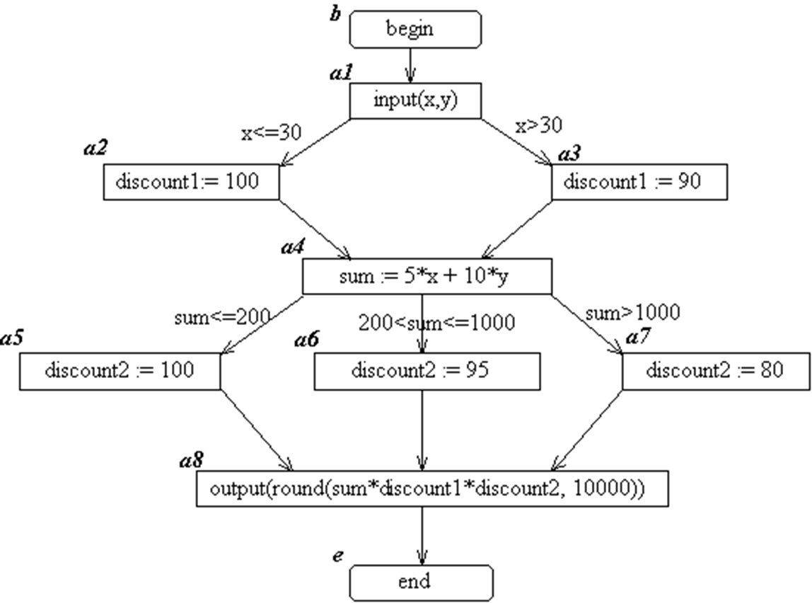

| **Path**                    | **Path Condition**                 |
| --------------------------- | ---------------------------------- |
| (b,  a1, a2, a4, a5, a8, e) | x  ≤ 30, (5*x + 10*y) ≤ 200        |
| (b,  a1, a2, a4, a6, a8, e) | x  ≤ 30, 200 < (5*x + 10*y) ≤ 1000 |
| (b,  a1, a2, a4, a7, a8, e) | x  ≤ 30, 1000 < (5*x + 10*y)       |
| (b,  a1, a3, a4, a5, a8, e) | 30<x,  (5*x + 10*y) ≤ 200          |
| (b,  a1, a3, a4, a6, a8, e) | 30<x,  200 < (5*x + 10*y) ≤ 1000   |
| (b,  a1, a3, a4, a7, a8, e) | 30<x,  1000 < (5*x + 10*y)         |

1. 程序流程：
- 首先根据x值判断是否给予额外10%折扣
  * x ≤ 30: discount2 = 100 (无折扣)
  * x > 30: discount2 = 90 (10%折扣)
- 然后计算总价：sum = 5*x + 10*y
- 根据总价决定基本折扣率：
  * sum ≤ 200: discount1 = 100 (无折扣)
  * 200 < sum ≤ 1000: discount1 = 95 (5%折扣)
  * sum > 1000: discount1 = 80 (20%折扣)

2. 程序路径（根据流程图）：
有6个可能的执行路径，每个路径对应不同的条件组合：

路径1: (b, a1, a2, a4, a5, a8, e)
- 条件：x ≤ 30 且 总价 ≤ 200
- 无任何折扣

路径2: (b, a1, a2, a4, a6, a8, e)
- 条件：x ≤ 30 且 200 < 总价 ≤ 1000
- 有5%折扣

以此类推...

### N-Border /1-Nearby  Criterion

Let {*D*1, *D*2,..., *D*n} be the set of sub-domains, which has *N* input variables. 

A set *T* of test cases is said to be adequate according to the ***N-Border/1-Nearby*** test criterion, if for each sub-domain $D_i$, *i*=1, 2, ..., *n*, and each border *B* of *$D_i$*, there are at least *N* test cases on the border *B* and at least one test case which is near (or just off) the border *B*. If the border is in the domain *$D_i$*, the test case near the border should be an off test point; otherwise, the test case near the border should be an on test point. 

让我解释N-Border/1-Nearby边界分析方法：

1. 基本概念：
- N：表示输入变量的数量（在这个例子中N=2，x和y两个变量）
- 边界点：位于边界线上的测试点
- 近邻点：位于边界线附近的测试点

2. 测试充分性标准：
对于每个子域Di和它的每个边界B：
- 至少需要N个边界上的测试点
- 至少需要1个边界附近的测试点

3. 近邻点的选择规则：
- 如果边界属于当前子域：选择域外的测试点(off test point)
- 如果边界不属于当前子域：选择域内的测试点(on test point)

4. 应用到示例图中：
以α边界（x=30的竖线）为例：
```
边界测试点：
- 需要2个点（因为N=2）
- 可以选择(30,20)和(30,60)

近邻测试点：
- 如果测试B区域：选择(31,20)作为off test point
- 如果测试E区域：选择(29,20)作为on test point
```

#### Example: Test Cases for sub-domain E

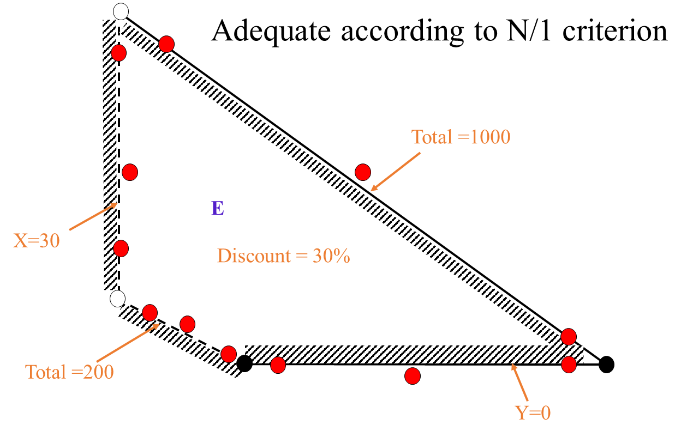

让我解释这个子域E的测试用例示例：

1. 图中的关键边界：
- X=30 的垂直边界
- Total=200 的下边界
- Total=1000 的上边界
- Y=0 的水平边界

2. N/1标准的应用：
- N=2（两个输入变量x,y）
- 在每个边界上需要2个测试点（红点）
- 每个边界附近需要1个测试点（黑点）

3. 测试点分布：
- 垂直边界(X=30)上有多个红点
- 斜线边界(Total=200, Total=1000)上有多个红点
- 水平边界(Y=0)上有红点
- 边界附近有对应的黑点作为近邻测试点

4. 特点：
- N-Border/1-Nearby准则对于检测平移错误很有效
  * 能发现边界整体移动的问题
- 但对于旋转错误的检测效果较差
  * 难以发现边界倾斜角度改变的问题

5. 子域E的特征：
- 位于X>30的区域
- 折扣率为30%
- 边界由Total=200和Total=1000两条线限定

### N-Border/N-Nearby Criterion

**Definition** **2** (N-border/N-nearby)

Let {*D*1, *D*2,..., *$D_i$*} be the set of sub-domains of software S, which has *N* input variables. 

A set *T* of test cases is said to adequate according to the *N-Border/N-Nearby test criterion*, if for each sub-domain *$D_i$*, *i*=1,2,...,*n*, and each border *B* of $D_i$ there are at least N test cases on the border *B* and at least *N* test cases near (just off) the border *B*. If the border *B* is in the domain *$D_i$*, the *N* test cases near the border should be off test points; otherwise they should be on test points. 

1. 基本要求：
对于每个子域Di和它的每个边界B，需要：
- N个边界测试点：直接在边界B上
- N个近邻测试点：在边界B附近

2. 近邻点选择规则：
- 如果边界B属于域Di：选择N个域外测试点(off test points)
- 如果边界B不属于域Di：选择N个域内测试点(on test points)

3. 与N-Border/1-Nearby的区别：

- 近邻点数量从1个增加到N个
- 提供更好的旋转错误检测能力
- 测试更全面但需要更多测试用例

这种方法特别适合需要高可靠性测试的场景，因为它能更好地检测边界处理的问题。  

#### Example: N-Border/N-Nearby Test Cases

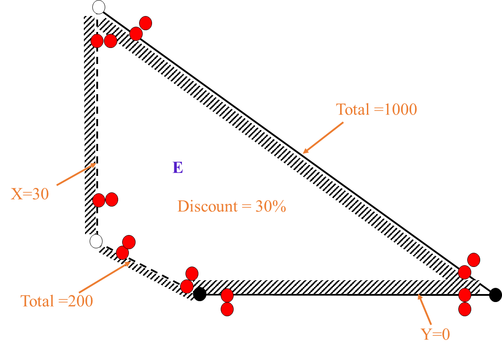

红点表示所有测试点，包括：

- 边界上的测试点（N-Border）
- 边界附近的测试点（N-Nearby）

对于每个边界：

- 边界上直接有N个红点（因为N=2，所以每个边界上至少有2个）
- 边界附近也有N个红点作为近邻测试点

例如，看X=30这条边界：

- 在边界线上有多个红点
- 在边界线左右两侧也有红点，这些是近邻测试点

其他标记：

- 黑点可能表示边界交点
- 白点可能是图示用的辅助点

### Vertex Coverage Criterion

**Definition** 

Let {*D*1, *D*2,..., $D_n$} be the set of sub-domains of software S. A set *T* of test cases is said to be adequate according to *vertex coverage test criterion*, if for each sub-domain *$D_i$*, *i*=1,2,...,*n*, *T* contains the vertices of *$D_i$* and for each vertex *v* of *$D_i$* there is a test case near (just off) the vertex *v*. If a vertex *v* of *D**i* is in the sub-domain *$D_i$*, then the test case near v should be an off test point; otherwise it should be an on point. 

顶点的定义：

- 两个或多个边界相交的点
- 对于无限延伸的边界，在远端选择一个点作为顶点

测试要求： 对于每个子域Di的每个顶点v：

- 需要在顶点v处有测试点
- 需要在顶点v附近有一个测试点
- 如果顶点v属于子域Di：附近测试点应该在域外(off test point)
- 如果顶点v不属于子域Di：附近测试点应该在域内(on test point)

顶点测试的意义：

- 测试多个边界条件的组合效果
- 验证边界交叉处的行为
- 检查边界极限情况

####  Example: Vertex Coverage Test Cases

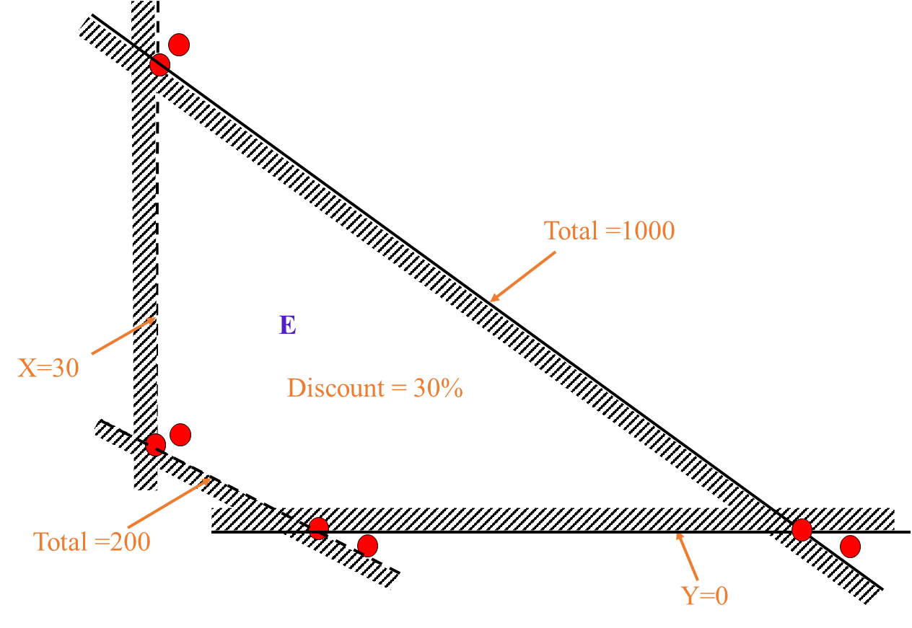

1. 顶点位置：
- X=30和Total=200线的交点
- Total=200线和Y=0线的交点
- 边界延伸的远端点（比如线段末端的点）

2. 测试点的布置：
- 在每个顶点处有一个红点（测试点）
- 在每个顶点附近也有一个红点（近邻测试点）
- 在边界延伸的末端点也设置了测试点

3. 特别说明：
- 对于Y=0这条线的右端，因为是边界延伸的末端，也被视为一个顶点
- 每个顶点都有对应的附近测试点，用于测试顶点周围的行为

4. 与其他测试方法的区别：
- 比N-Border/1-Nearby更关注边界交叉点
- 测试点数量可能更少，但更关注关键位置
- 适合测试多个条件组合的情况

这种测试方法特别适合检测边界条件的组合效果，因为顶点是多个边界条件同时生效的地方。