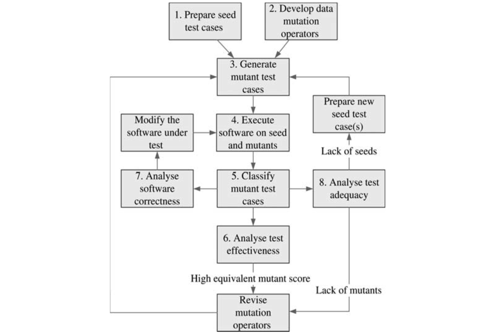
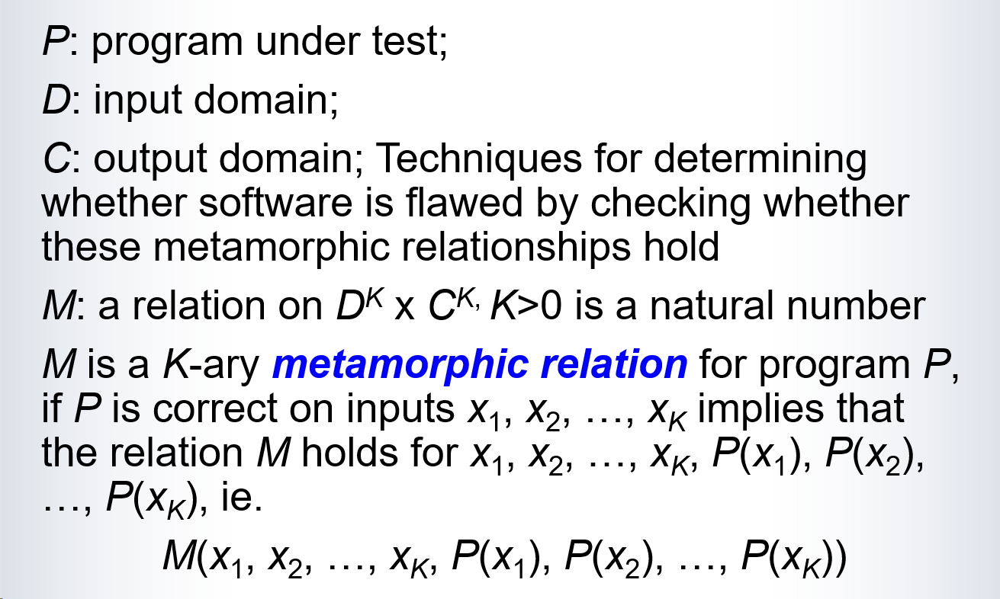

# Random Testing / Statistical Testing

Basic idea

- Select test cases/data (usually only the input) at random in the input space

Two types of random testing according to the probability distribution for random sampling

- Representative random testing

  - The random sampling of the input according to the probability distribution that represents the user’s input in the operation of the system

  - Software reliability can be estimated

- Non-representative random testing
  - The probability distribution is irrelevant to the user’s input 

基本思想：
- 在输入空间中随机选择测试用例/数据

两种类型：

1. 代表性随机测试
- 根据系统实际用户输入的概率分布进行随机采样
- 可以用来估算软件可靠性

2. 非代表性随机测试
- 采用与用户实际输入无关的概率分布
- 更注重覆盖不同的测试场景

# Random Sampling of Operation Profile

Operation Profile

*In practice, operation profiles are also produced for special situations.* 

- A collection of records of the typical operations of a system

- For example: 

  - A set of bank transactions for a period of time as a profile of banking system

  - A set of keywords submitted to a web search engine for a period of time 

  - A log file of service requests for an online system 

操作配置文件定义：系统典型操作的记录集合

三个典型例子：
1. 银行系统：一段时间内的银行交易记录
2. 搜索引擎：用户提交的关键词集合
3. 在线系统：服务请求的日志文件

# Random Walk/Tour

Recall: GUI state transition diagram model of an interactive software system

- **Nodes**: the states of the system as displayed in the GUI
- **Edges**: the operations on the GUI elements, such as click a button, select a menu item, entering text, etc. 

Random walk is to select any of the applicable operations at random

- *Representative random testing*: if the operations are selected according to a distribution reflect real usage
- *Non-representative random testing*: select operation regardless of the real operation, such as using the uniform distribution 

1. GUI状态转换图包含：
- 节点：系统GUI界面状态
- 边：用户操作（点击、菜单选择、文本输入等）

2. 随机游走测试分两类：
- 代表性：根据真实使用频率选择操作
- 非代表性：使用均匀分布等选择操作，不考虑实际使用情况

这种方法模拟用户在界面上的随机操作，用于发现潜在问题和异常行为。

# Combination with Partition Testing

Partition testing

- The input space is partitioned into a number of sub-domains as in domain analysis

- Test cases are selected on and near boundaries for each sub-domain

- Test cases are selected in each sub-domain

  - The test cases are **sampled at random** in each sub-domain 

  - The number of test cases are often determined according to the **risk**, **importance**, and **complexity** of the function on the sub-domain

**分区测试**

输入空间划分

- 基于领域分析将输入空间分成多个子域
- 确保子域之间相互独立，覆盖完整输入空间
- 通常基于功能特性或数据特征进行划分

边界测试用例

- 在子域边界点选择测试用例
- 在边界附近选择测试用例
- 特别关注边界条件，因为这里容易出现缺陷

域内测试用例

- 在每个子域内进行随机采样
- 采样数量基于三个关键因素：
  - 风险：可能造成的损失或影响
  - 重要性：功能对系统的关键程度
  - 复杂度：实现的技术难度

# RT’s Fault Detection Ability

- Let *θ* the *failure rate* of the software (i.e. the probability that the software fails in operation)
- Fault detection ability:the expect number of failures in *n* tests is *nθ*
- Reliability estimation
  - If a random test on *n* test cases fails on *f* test cases, the failure rate is *θ*=*f/n* as the maximum likelihood. 

故障率(θ)定义与应用

- 含义：软件运行失败的概率
- 测试目标：评估系统实际故障率
- 应用：指导测试策略和资源分配

故障检测能力计算

- 公式：在n次测试中预期故障数 = nθ
- 意义：评估测试效果的量化指标
- 应用：帮助确定所需测试次数

可靠性估计方法

- 计算：θ = f/n（f为失败次数，n为总测试次数）
- 特点：最大似然估计法
- 前提条件：测试用例必须遵循与实际输入相同的概率分布

# Partition Testing’s Fault Detection Ability 

Assumptions:

The input space is divided into *k*>0 disjoint sub-domains *D*1, *D*2, …, $D_k$ of size *d*1, *d*2, …, *$d_k$*, respectively. 

In sub-domain $D_i$, there are *m*i input points that causes failure, *i*=1,2,…, *k*. 

*$n_i$* test cases are selected at random in sub-domain *$D_i$*, *i*=1,2,…, *k*. 

Fault detection ability:The expected number of failures: $\sum^k_{i=1} n_i \theta_i$

1. 输入空间划分

- 将整个输入空间分成k个互不相交的子域
- 每个子域Di有特定大小di
- 子域划分需确保完整覆盖输入空间
- 划分标准通常基于功能特征或数据特性

2. 子域故障特征

- 每个子域Di包含mi个可能导致故障的输入点
- mi/di表示该子域的故障密度
- 不同子域可能有不同的故障密度
- 这反映了不同区域的风险程度

3. 测试用例选择

- 在每个子域Di中随机选择ni个测试用例
- ni的选择考虑子域的重要性和复杂度
- 样本量需要足够大以保证统计意义
- 采样策略影响检测效果

4. 故障检测能力计算

- 总体故障检测期望：Σ(niθi)
- θi为子域Di的故障率(mi/di)
- 这个公式考虑了每个子域的特性
- 可用于评估和优化测试策略

# Data Mutation Testing

Basic ideas

- Give a set of existing test cases/data as the seeds
- Modify the test cases/data slightly to make a new test case, which are called mutant test case
- Execute program on both seed and mutant test cases 

Key factors of success:

- How to modify the test cases/data?
- How to determine if the program is correct on a mutant? 
- How to measure test adequacy? 
  - Enough seeds have been used?
  - Enough mutants have been generated?

数据变异测试(Data Mutation Testing)包含两个主要部分：

基本思想：

- 使用现有测试用例作为种子
- 对种子进行微小修改生成变异测试用例
- 在种子和变异用例上执行测试

成功关键因素：

1. 测试用例修改策略

- 如何选择合适的变异操作
- 变异程度的控制
- 确保变异后测试用例的有效性

2. 变异测试正确性判断

- 程序在变异测试用例上的行为评估
- 与原始测试用例结果比对
- 异常行为识别

3. 测试充分性度量

- 种子测试用例的覆盖范围
- 变异测试用例的数量和多样性
- 变异操作的覆盖程度

## Process of Data Mutation Testing

数据变异测试流程包含8个主要步骤：

1. 准备种子测试用例

   - 选择代表性测试数据

   - 确保基本功能覆盖

2. 开发变异操作符

   - 设计数据修改规则

   - 定义变异策略

3. 生成变异测试用例

   - 应用变异操作

   - 创建新测试数据

4. 执行测试

   - 运行原始和变异用例

   - 记录执行结果

5. 变异用例分类

   - 分析执行结果

   - 标记失效情况

6. 测试有效性分析

   - 评估变异效果

   - 检查等价变异分数

7. 软件正确性分析

   - 评估程序行为

   - 发现潜在问题

8. 测试充分性分析

   - 评估覆盖程度

   - 决定是否需要更多测试

反馈循环：
- 高等价变异分数→修改变异操作符
- 种子不足→准备新种子
- 变异不足→修改变异策略

## Example: Triangle Classification

Input:

- three natural numbers x, y, z (represents the sides of a triangle)

The function:

- to determine if the value of x, y, z form a triangle of

  - equilateral (all sides the same length) or 

  - isosceles (two the same) or 

  - scalene (none the same) or 

  - the input does not represent a triangle (when the sum of two parameters is not greater than the third). 

### Step 1: Preparation of Seeds

One may design a set of test cases as follows: 

t1: 

- *Input*: (x=5, y1=5, z=5), 
- *Expected* *output*: equilateral. 

t2: 

- *Input*: (x= 5, y = 5, z = 7), 
- *Expected* *output*: isosceles. 

t3: 

- *Input*: (x=5, y=7, z=9), 
- *Expected* *output*: scalene. 

t4: 

- *Input*: (x=3, y=5, z=9), 
- *Expected* *output*: not a triangle. 

准备种子测试用例

- 设计一组基础测试用例作为"种子"
- 每个测试用例包含输入数据和预期输出

### Step 2: Design Data Mutation Operators

- IVP Increase the value of a parameter by 1
- DVP Decrease the value of a parameter by 1
- SPL Set the value of a parameter to a very large number, say 1000 000
- SPZ Set the value of a parameter to 0 
- SPN Set the value of a parameter to a negative number, say -2 
- WXY Swap the values of parameters x and y
- WXZ Swap the values of parameters x and z
- WYZ Swap the values of parameters y and z
- RPL Rotate the values of parameters towards left 
- RPR Rotate the values of parameters towards right 

*Usually, data mutation operators can be easily implemented as short procedures/methods that read in a set of test data and generate a number of new test data.* 

设计变异算子

- 定义一系列数据变异规则
- 常见变异包括：增加/减少值、设置极值、交换参数位置等
- 变异算子通常实现为简单的函数/方法

### Step 3: Generate Mutant Test Data 

Apply every mutation operator to every test data on every possible location

For example, 

- applying the mutation operator IVP to test case t1 on parameter x, we can obtain the following test case t5. 
  - Test case t5: *Input*:(x=6, y=5, z=5). 

生成变异测试数据

- 执行步骤：
  - 遍历每个种子测试用例
  - 对每个参数应用所有适用的变异算子
  - 记录生成的变体用例
- 例如：
  - 原始：(5,5,5)
  - IVP变异：(6,5,5)、(5,6,5)、(5,5,6)
  - WXY变异：(5,5,5)

### Step 4: Test Executions and Classification of Mutants

The software under test is executed on the seed test cases as well as their mutant test cases. 

- The outputs and/or other aspects of dynamic behaviour of the software on each test case are observed and recorded. 

The mutants are classified:

- *Dead*: if the execution of the software under test on the mutant is different from the execution on the seed test case.
- *Alive*: Otherwise. 

测试执行和分类

- 执行过程：
  - 运行原始用例获取基准结果
  - 运行每个变体并记录结果
  - 比较变体与原始结果
- 分类标准：
  - "已杀死"：行为不同
  - "存活"：行为相同

### Step 5: Analyse Test Effectiveness 

Reasons that a mutant remains alive: 

- The mutant is equivalent to the original. 
  - For example: applying the RPL mutation operator to test case t1 will produce a test case identical to t1. 

- The observation on the behaviour is weak. 

  - For example: applying the RPL operator to test case t2 will produce the following test case. 

  - t6: *Input*:(x=5, y=7, z=5). 

  - Just to compare the output not sufficient to detect the difference

- The software is incorrect
  - It is unable to differentiate the mutants from the original even though they are not equivalent. 

分析测试有效性

- 评估维度：
  - 变异算子覆盖率
  - 变体存活率
  - 测试用例有效性
- 存活原因分析：
  - 等价变异
  - 观察不充分
  - 软件缺陷
- 改进方向：
  - 优化变异算子
  - 增强观察机制
  - 补充测试用例

## Metrics of Data Mutation

Equivalent mutant score EMS:
$$
EMS = \frac{EM}{TM}
$$
where :

- EM is the number of equivalent mutants
- TM is the total number of mutants

High EMS means:

- Mutation operator failed to generate a wide variety of mutants that are different from the original
- Low effectiveness of testing
- Consider revise the mutation operators

数据变异测试度量(Metrics)主要关注等价变异分数(EMS)：

EMS计算公式：
- EMS = EM/TM
- EM: 等价变异体数量
- TM: 总变异体数量

高EMS的含义：
1. 变异算子效果差
- 生成的变异体与原始用例过于相似
- 未能产生足够多的有效测试场景

2. 测试效果不佳
- 难以发现潜在缺陷
- 测试覆盖不充分

3. 改进建议
- 重新设计变异算子
- 增加变异类型
- 调整变异参数范围
- 考虑更复杂的变异规则

理想情况下应该保持较低的EMS，表明变异测试能够有效生成差异化的测试用例。

## Analysis of Data Mutation Testing

**Advantages**

- **Automation**: Generation of a large number of test cases from a small set of seeds can be automated 
- **Applicability**: Applicable to all software, especially for highly complicated input space
- **Effectiveness**:
  - Test cases are meaningful and representative to real use of the software
  - Can detect both design and implementation errors

**Problems to be solved** 

- **Automation**: Mutation operators on test data are specific to each application. It requires testers to design and code data mutation operators. 
- **Effectiveness:**
  - Heavily depends on mutation operators => Require knowledge and skill to design good mutation operators
  - Require good seeds

数据变异测试分析：

优势：
1. 自动化：
   - 从少量种子用例自动生成大规模测试集
   - 减少人工设计测试用例的工作量
   - 提高测试执行效率

2. 适用性：
   - 适合各类软件系统测试
   - 特别适合输入空间复杂的系统
   - 不需要了解软件内部实现细节

3. 有效性：
   - 测试用例具有实际代表性，模拟真实使用场景
   - 可检测设计缺陷：发现软件架构和设计问题
   - 可检测实现错误：发现代码级别的错误
   - 通过变异提供多样化的测试场景

待解决问题：
1. 自动化挑战：
   - 变异算子需定制开发，针对具体应用特点
   - 需要专业人员设计和实现变异算子
   - 维护成本较高，需要持续更新和优化

2. 有效性限制：
   - 变异算子质量决定测试效果：
     * 需要深入理解应用领域
     * 需要测试设计经验
     * 需要编程实现能力
   - 种子用例质量影响覆盖范围：
     * 需要精心设计初始测试集
     * 需要确保种子用例的代表性
     * 需要平衡测试成本和覆盖度

# Fuzz Testing

- Similar to data mutation testing in the sense that it also make changes on existing test cases 
- Generate test cases by applying random changes to existing test cases 
  - In contrast to data mutation testing where testers design data mutation operators according to the application
- Execute the program to see if it crashes. 

Fuzz Testing的主要特点：

与数据变异测试的相同点：

- 基于已有测试用例进行修改
- 生成新的测试数据

关键差异：

- 变异方式：采用随机变异而非预定义的变异算子
- 设计要求：无需专门设计变异规则，降低了测试设计难度
- 测试目标：主要关注程序崩溃等严重错误，而非具体功能验证

局限性：

- 测试针对性较弱
- 难以系统性覆盖边界情况
- 可能产生大量无效或重复的测试用例

# Metamorphic Testing 

Example:

A relation for a program that computes *Sin*(*x*) function must satisfy:
$$
x_1+x_2=\pi => Sin(x_1)=Sin(x_2)
$$
Metamorphic Testing : Techniques for determining whether software is flawed by checking whether these **metamorphic** **relationships** (A certain relationship between multiple pairs of input/output of the software under test) hold

Metamorphic Testing的核心是基于软件的蜕变关系(metamorphic relationship)进行测试。以sin(x)函数为例：

关系定义：
当x1 + x2 = π时，sin(x1) = sin(x2)

测试实施：
1. 选择测试输入：x1 = π/4
2. 计算关联输入：x2 = π - π/4 = 3π/4
3. 执行程序：计算sin(π/4)和sin(3π/4)
4. 验证结果：检查两个结果是否相等

优点：
- 不需要精确的预期结果
- 可以自动生成相关的测试用例
- 适用于难以确定准确输出的场景

这种方法通过检验输入输出之间的数学关系来验证程序的正确性。

Basic Idea:

- To use **metamorphic relations** as the criteria of program correctness, i.e. as a test oracle
- To use **metamorphic relations** as a test data generation technique

1. Metamorphic Testing should include multiple execution
2. we put emphasis on the metamorphic relatioin between multiple pairs of input/output

It is capable of partially ensuring correctness, which means that if the program fails a test according to the oracle implies that the program is not correct on the test case. 

Metamorphic Testing的基本思想：

1. 作为测试标准：
- 使用蜕变关系作为程序正确性的判断依据
- 代替传统的测试结果验证方法

2. 测试数据生成：
- 基于蜕变关系设计关联的测试输入
- 通过已有测试用例生成新的测试数据

关键特点：
- 需要多次程序执行
- 关注输入/输出对之间的关系
- 可部分保证程序正确性：如果测试失败，则程序一定存在错误

## Metamorphic and Traditional Testing

In traditional software testing, the principle is: given input, observe the output of the software under test, and compare it with the expected output. Defects in the software are determined based on the comparison results.

Traditional testing operates under a fundamental assumption that the expected output of the software is known. However, in many cases, the expected output of the software is either unknown or very difficult to determine.

 Metamorphic Testing :

1. should include multiple execution
2. put emphasis on the metamorphic relatioin between multiple pairs of input/output

传统测试与蜕变测试的主要区别：

传统测试：
- 需要已知期望输出
- 直接比对实际输出和期望输出
- 难以处理期望输出未知或难以确定的情况

蜕变测试：
- 无需确切的期望输出
- 验证输入输出对之间的关系
- 需要多次执行程序
- 适用于期望输出难以确定的场景

蜕变测试克服了传统测试在处理复杂系统时的局限性，特别适合测试机器学习、搜索引擎等结果难以预测的系统。

## Definition: Metamorphic Relation 

基本要素：

1. 程序P：被测试的程序
2. 输入域D：所有可能的输入集合
3. 输出域C：所有可能的输出集合
4. K元关系M：建立在K个输入输出对之间的关系

关系定义： M是定义在D^K × C^K上的关系，其中：

- D^K表示K个输入的笛卡尔积
- C^K表示K个输出的笛卡尔积
- K必须是正整数

成立条件： 当程序P对输入x1到xK运行正确时，必须满足： M(x1,...,xK, P(x1),...,P(xK))为真

具体示例：

1. sin(x)函数（K=2）：

- 输入域D：实数
- 输出域C：[-1,1]
- 关系M：x1+x2=π ⟹ P(x1)=P(x2)

2. 排序程序（K=2）：

- 输入域D：数组集合
- 输出域C：有序数组集合
- 关系M：输入数组内容相同 ⟹ 输出数组相同

在医学图像ML系统测试中的蜕变关系应用：

蜕变关系定义：
- 图像旋转180度
- 颜色强度变化
- 轻微失焦

测试步骤：
1. 对原始医学图像进行模型评估
2. 应用图像增强：
   - 模拟失焦模糊
   - 旋转图像
   - 调整颜色
3. 评估增强后图像
4. 验证输出一致性

这种方法确保ML系统对临床实际中常见的图像变化保持稳健性。例如，图像拍摄时的角度、光线和对焦差异不应影响诊断结果。

# Mutational Metamorphic Testing

It is a combination of Data mutation testing and metamorphic testing techniques

Observation: 

The metamorphic relation
$$
x_1+x_2 = \pi => Sin(x_1)=Sin(x_2)
$$
can be equivalently represented as follows:
$$
Sin(x)=Sin(\pi-x)
$$
where *π* *-* *x* can be considered as a data mutation operator.

Using data mutation operators, many metamorphic relations can be represented in the following form:

突变蜕变测试(Mutational Metamorphic Testing)结合了数据变异测试和蜕变测试的特点：

1. 基本思想：

- 将蜕变关系转化为数据变异形式
- 使用变异算子生成测试数据

1. 转化示例： 原始蜕变关系：x1 + x2 = π ⇒ Sin(x1) = Sin(x2) 变异形式：Sin(x) = Sin(π - x) 其中π - x作为变异算子
2. 一般形式： V(x1,...,xK) ⇒ R(P(x1),...,P(xK),P(f(x1,...,xK,l)))

突变蜕变关系的形式化定义详解：

基本元素：
1. $P: D \rightarrow C$：被测程序，从输入域映射到输出域
2. $f: D^K \times L \rightarrow D$：K元变异算子，带位置参数l∈L
3. $V: D^K \rightarrow \{true,false\}$：变异适用条件
4. $R: C^{K+1} \rightarrow \{true,false\}$：输出关系

定义公式：
$$\forall x_1,...,x_K \in D, \exists l \in L, x_{K+1} = f(x_1,...,x_K,l)$$
$$V(x_1,...,x_K) \wedge P正确 \Rightarrow R(P(x_1),...,P(x_K),P(x_{K+1}))$$

应用示例：
对于sin函数：
- $f(x) = \pi - x$：变异算子
- $V(x) = true$：无限制条件
- $R(y_1,y_2) = (y_1 = y_2)$：输出相等关系

完整表示：
$$x \in D \Rightarrow Sin(x) = Sin(\pi - x)$$

这种定义将蜕变关系通过变异算子表达，使测试更系统化和自动化。